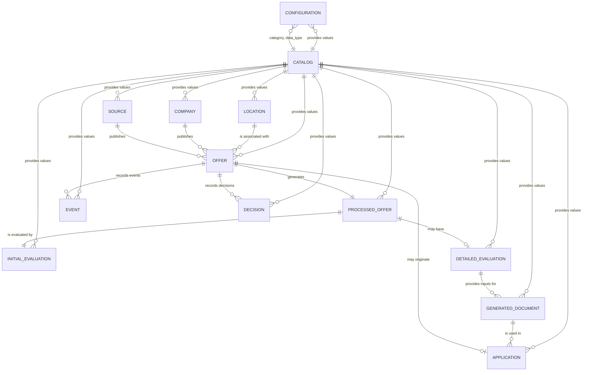

# Document 13A - Detailed Data Model Design

# 1. Official Entity Inventory

This inventory constitutes the official record of all persistent entities that will make up the data model of the job search automation.

Each entity will be developed later in this document through its detailed specification.

| Entity | Category | Functional Domain | Description |
|---------|-----------|-------------------|-------------|
| Offer | Main | Opportunity Discovery | Represents each job offer identified by the automation during the search process. |
| Source | Main | Opportunity Discovery | Represents the origin from which a job offer is obtained. |
| Company | Main | Opportunity Discovery | Represents the organization that publishes the job offer. |
| Location | Support | Opportunity Discovery | Represents the geographic information associated with a job offer. |
| Processed Offer | Main | Offer Processing | Represents the structured and normalized version of an offer after its processing. |
| Initial Evaluation | Main | Initial Evaluation | Represents the result of the initial evaluation carried out on a job offer. |
| Detailed Evaluation | Main | Detailed Evaluation | Represents the result of the complete evaluation of an offer that passed the initial evaluation. |
| Generated Document | Operational | Document Generation | Represents the documents automatically generated by the automation for a given offer. |
| Application | Main | Application Management | Represents each application process carried out on a job offer. |
| Event | Operational | Traceability | Records relevant events that occurred during automation processing. |
| Decision | Operational | Decision Model | Records the functional decisions made by the automation during the processing of an offer. |
| Configuration | Support | Configuration | Represents the configuration used by the automation during its execution. |
| Catalog | Support | References | Represents the sets of controlled values used by the different entities of the model. |

> **Scope of implemented persistence (decision 2026-07-30):** the MVP database (`job_search.db`) persists a trimmed subset of the model above: `secuencia_ids`, `fuentes`, `empresas`, `ubicaciones`, and `ofertas`. The remaining entities of this inventory are deferred to later modules and are defined in their corresponding phases. This note formalizes the actual persistence scope; the full inventory above remains the target model.

---

# 2. Detailed Specification of Entities

This chapter will document in detail each of the entities that make up the automation's data model.

Each entity will be specified using a uniform structure in order to guarantee consistency, facilitate database implementation, and maintain traceability with the rest of the project documentation.

The specification of each entity will include, at a minimum, the following information:

- Entity name.
- Description.
- Purpose within the automation.
- Attributes.
- Primary key.
- Alternate keys (when they exist).
- Foreign keys (when they exist).
- Relationships with other entities.
- Relationship cardinality.
- Constraints.
- State machine (when applicable).
- Observations.

The entities will be documented in the following order:

1. Offer.
2. Source.
3. Company.
4. Location.
5. Processed Offer.
6. Initial Evaluation.
7. Detailed Evaluation.
8. Generated Document.
9. Application.
10. Event.
11. Decision.
12. Configuration.
13. Catalog.

---

## 2.1. Entity: Offer

### Description

The **Offer** entity represents each job opportunity identified by the automation during the opportunity discovery process.

It constitutes the main entity of the data model, since all subsequent automation processing is performed around a job offer.

Each record corresponds to a single offer identified in a given source.

---

### Purpose

Its purpose is to store the original information of each discovered offer before any normalization, evaluation, or document generation process.

The entity preserves the official reference of the offer throughout its entire lifecycle within the automation.

---

### Attributes

| Attribute | Logical Type | Required | Description |
|----------|-------------|-------------|-------------|
| id | UUID | Yes | Unique identifier of the offer. |
| source_id | UUID | Yes | Reference to the source where the offer was discovered. |
| company_id | UUID | Yes | Reference to the company that publishes the offer. |
| location_id | UUID | No | Reference to the location associated with the offer. |
| source_identifier | Text | No | Identifier used by the source of origin for the offer. |
| url | Text | Yes | Original link of the offer. |
| title | Text | Yes | Original title of the offer. |
| original_description | Long Text | Yes | Original content of the offer obtained during discovery. |
| publication_date | Date/Time | No | Publication date indicated by the source. |
| discovery_date | Date/Time | Yes | Date and time when the automation discovered the offer. |
| status | Catalog | Yes | Current status of the offer within the processing flow. |
| active | Boolean | Yes | Indicates whether the offer remains valid within the system. |
| observations | Long Text | No | Additional relevant information about the offer. |
| creation_date | Date/Time | Yes | Date and time of record creation. |
| update_date | Date/Time | Yes | Date and time of the last record update. |

---

### Primary key

- id

---

### Alternate keys

- None.

---

### Foreign keys

- source_id → Source
- company_id → Company
- location_id → Location
- status → Catalog

---

### Relationships

| Related entity | Relationship | Cardinality |
|----------------------|----------|--------------|
| Source | Belongs to | N : 1 |
| Company | Is published by | N : 1 |
| Location | Is located in | N : 1 |
| Processed Offer | Generates | 1 : 1 |
| Initial Evaluation | Is evaluated by | 1 : 1 |
| Detailed Evaluation | May generate | 1 : 0..1 |
| Generated Document | May generate | 1 : N |
| Application | May originate | 1 : 0..1 |
| Event | Records events | 1 : N |
| Decision | Records decisions | 1 : N |

---

### Constraints

- Every offer must belong to a single source.
- Every offer must be associated with a single company.
- The offer URL must be preserved throughout its entire lifecycle.
- The original content of the offer must not be overwritten after its discovery.
- The offer status must follow the state machine defined for the entity.

---

### State machine

The entity will follow the official state machine defined for job offer processing.

The detailed specification of said state machine will be documented in the corresponding section of this document.

---

### Observations

The **Offer** entity constitutes the entry point of the data model and serves as the main reference for all entities derived from the processing, evaluation, and application process.


---

## 2.2. Entity: Source

### Description

The **Source** entity represents each origin from which the automation discovers job opportunities.

A source corresponds to a platform, website, job portal, corporate page, or any other authorized means for obtaining job offers.

---

### Purpose

Its purpose is to centralize the information of each data origin used by the automation, allowing the identification of the provenance of each offer and the management of the particular characteristics of each source.

---

### Attributes

| Attribute | Logical Type | Required | Description |
|----------|-------------|-------------|-------------|
| id | UUID | Yes | Unique identifier of the source. |
| name | Text | Yes | Official name of the source. |
| type | Catalog | Yes | Type of source used by the automation. |
| main_url | Text | Yes | Main URL of the source. |
| description | Long Text | No | General description of the source. |
| active | Boolean | Yes | Indicates whether the source is enabled for offer discovery. |
| query_frequency | Catalog | No | Configured frequency for querying the source. |
| last_query | Date/Time | No | Date and time of the last query performed. |
| last_update | Date/Time | No | Date and time of the last detected update on the source, when it can be determined. |
| observations | Long Text | No | Additional relevant information about the source. |
| creation_date | Date/Time | Yes | Date and time of record creation. |
| update_date | Date/Time | Yes | Date and time of the last record update. |

---

### Primary key

- id

---

### Alternate keys

- None.

---

### Foreign keys

- type → Catalog
- query_frequency → Catalog

---

### Relationships

| Related entity | Relationship | Cardinality |
|----------------------|----------|--------------|
| Offer | Publishes | 1 : N |

---

### Constraints

- Every source must have a unique name within the system.
- The main URL must uniquely identify the source.
- New offers may not be associated with an inactive source.
- The source type must correspond to a valid value from the official catalog.

---

### State machine

Not applicable.

---

### Observations

The **Source** entity exclusively represents the origin of job offers.

It does not store specific information of an individual offer, but rather the general characteristics of the origin from which the automation obtains the information.

---

## 2.3. Entity: Company

### Description

The **Company** entity represents the organization responsible for publishing one or more job offers processed by the automation.

Each record corresponds to a company identified from information obtained from different job sources.

---

### Purpose

Its purpose is to centralize company information, avoiding data duplication when the same organization publishes multiple offers or uses different recruitment sources.

---

### Attributes

| Attribute | Logical Type | Required | Description |
|----------|-------------|-------------|-------------|
| id | UUID | Yes | Unique identifier of the company. |
| name | Text | Yes | Official name of the company. |
| normalized_name | Text | Yes | Standardized name used to avoid duplicates. |
| website | Text | No | Official website of the company. |
| linkedin | Text | No | URL of the company's official LinkedIn profile. |
| sector | Catalog | No | Economic sector to which the company belongs. |
| size | Catalog | No | Company size classification. |
| description | Long Text | No | General description of the company. |
| observations | Long Text | No | Additional relevant information about the company. |
| creation_date | Date/Time | Yes | Date and time of record creation. |
| update_date | Date/Time | Yes | Date and time of the last record update. |

---

### Primary key

- id

---

### Alternate keys

- None.

---

### Foreign keys

- sector → Catalog
- size → Catalog

---

### Relationships

| Related entity | Relationship | Cardinality |
|----------------------|----------|--------------|
| Offer | Publishes | 1 : N |

---

### Constraints

- The normalized name must be used to minimize the creation of duplicate companies.
- A company may be associated with multiple offers.
- A company may appear in multiple different sources without generating duplicate records.
- Sector and size values must correspond to the official catalogs when used.

---

### State machine

Not applicable.

---

### Observations

The **Company** entity only represents the organization that offers the vacancy.

It does not store specific information of a job offer, since that information belongs to the **Offer** entity.

The same company may publish multiple offers at different times and through different sources, always maintaining a single record within the data model.

---

## 2.4. Entity: Location

### Description

The **Location** entity represents the geographic location associated with a job offer.

Its purpose is to store location information in a normalized way, avoiding data duplication when multiple offers share the same place.

---

### Purpose

Centralize the geographic information of job offers to facilitate their query, filtering, analysis, and reuse within the automation.

---

### Attributes

| Attribute | Logical Type | Required | Description |
|----------|-------------|-------------|-------------|
| id | UUID | Yes | Unique identifier of the location. |
| country | Text | Yes | Country where the vacancy is offered. |
| region | Text | No | State, province, or department (actual name in `shared/models.py`). |
| city | Text | No | City of the vacancy. |
| address | Text | No | Specific address when available. |
| modality | Catalog | Yes | Work modality associated with the location (on-site, remote, hybrid, etc.). |
| location_type | Catalog | Yes | Classification of the offer location. |
| observations | Long Text | No | Additional information related to the location. |
| creation_date | Date/Time | Yes | Date and time of record creation. |
| update_date | Date/Time | Yes | Date and time of the last record update. |

---

### Primary key

- id

---

### Alternate keys

- None.

---

### Foreign keys

- modality → Catalog
- location_type → Catalog

---

### Relationships

| Related entity | Relationship | Cardinality |
|----------------------|----------|--------------|
| Offer | Is used by | 1 : N |

---

### Constraints

- Every location must indicate at least the country.
- The modality must correspond to a value defined in the official catalog.
- The location type must correspond to a value defined in the official catalog.
- Geographic coordinates may only be stored when the information is available and consistent with the registered location.

---

### State machine

Not applicable.

---

### Observations

The **Location** entity only represents the location associated with a job offer.

The work modality is incorporated in this entity because it is directly related to the way the vacancy is performed (on-site, remote, hybrid, etc.), allowing common locations to be reused across different offers and avoiding information duplication.

---

## 2.5. Entity: Processed Offer

### Description

The **Processed Offer** entity represents the structured, normalized, and enriched version of a job offer after being processed by the automation.

Its content is the result of interpreting the original information from the **Offer** entity, allowing subsequent stages to work with organized and consistent data.

---

### Purpose

Store the processed information of an offer to facilitate its evaluation, comparison, document generation, and decision-making, while preserving the original offer unchanged.

---

### Attributes

| Attribute | Logical Type | Required | Description |
|----------|-------------|-------------|-------------|
| id | UUID | Yes | Unique identifier of the processed offer. |
| offer_id | UUID | Yes | Reference to the original offer. |
| normalized_position | Text | Yes | Normalized name of the identified position. |
| processed_description | Long Text | Yes | Structured description of the offer. |
| summary | Long Text | No | Generated summary of the offer content. |
| technical_skills | Long Text | No | List of identified technical skills. |
| soft_skills | Long Text | No | List of identified soft skills. |
| technologies | Long Text | No | Technologies identified during processing. |
| experience_level | Catalog | No | Required experience level. |
| education_level | Catalog | No | Identified education level. |
| contract_type | Catalog | No | Identified contract type. |
| work_modality | Catalog | No | Identified work modality. |
| salary_range | Text | No | Normalized salary information when available. |
| languages | Long Text | No | Identified required or desirable languages. |
| benefits | Long Text | No | Benefits identified in the offer. |
| requirements | Long Text | No | Main requirements extracted from the offer. |
| responsibilities | Long Text | No | Identified main responsibilities. |
| processing_date | Date/Time | Yes | Date and time when processing finished. |
| processing_version | Text | Yes | Version of the processing process used. |
| observations | Long Text | No | Additional relevant information about the processing. |
| creation_date | Date/Time | Yes | Date and time of record creation. |
| update_date | Date/Time | Yes | Date and time of the last record update. |

---

### Primary key

- id

---

### Alternate keys

- offer_id

---

### Foreign keys

- offer_id → Offer
- experience_level → Catalog
- education_level → Catalog
- contract_type → Catalog
- work_modality → Catalog

---

### Relationships

| Related entity | Relationship | Cardinality |
|----------------------|----------|--------------|
| Offer | Is generated from | 1 : 1 |
| Initial Evaluation | Is used by | 1 : 1 |
| Detailed Evaluation | Is used by | 1 : 0..1 |
| Generated Document | Serves as input for | 1 : N |

---

### Constraints

- Every processed offer must be associated with a single original offer.
- There may not be more than one processed offer for the same offer.
- The processed information must not replace or modify the original content stored in the **Offer** entity.
- Values classified via catalogs must correspond to the official values defined for the project.

---

### State machine

Not applicable.

---

### Observations

The **Processed Offer** entity constitutes the structured representation of a job offer and acts as the basis for subsequent stages of evaluation and document generation.

Its existence allows preserving the original information obtained during discovery while having an optimized version available for the automation's internal processing.

**Recorded deviations (PMD-020):**

- `requisitos`, `tecnologias`, and `idiomas` are implemented as JSON lists (real improvement) instead of `Long Text`.
- The `summary`, `technical_skills`, and `soft_skills` attributes are not implemented in the current model (`shared/models.py`).

---

## 2.6. Entity: Initial Evaluation

### Description

The **Initial Evaluation** entity represents the result of the first evaluation performed on a processed offer.

Its purpose is to determine, using criteria previously defined by the project, whether an offer should continue to detailed evaluation or be discarded.

---

### Purpose

Record the result of the initial evaluation of each offer, preserving the information used for decision-making and enabling traceability of the filtering process.

---

### Attributes

| Attribute | Logical Type | Required | Description |
|----------|-------------|-------------|-------------|
| id | UUID | Yes | Unique identifier of the initial evaluation. |
| processed_offer_id | UUID | Yes | Reference to the evaluated processed offer. |
| result | Catalog | Yes | Result obtained in the initial evaluation. |
| score | Decimal | Yes | Total score obtained during the initial evaluation. |
| pass_threshold | Decimal | Yes | Minimum score required to pass the evaluation. |
| decision | Catalog | Yes | Decision generated from the evaluation result. |
| justification | Long Text | Yes | Justification for the decision made. |
| evaluated_criteria | Long Text | Yes | Summary of the criteria applied during the evaluation. |
| observations | Long Text | No | Additional relevant information about the evaluation. |
| evaluation_date | Date/Time | Yes | Date and time when the evaluation was performed. |
| version_modelo | Text | Yes | Version of the model, rules, or configuration used to perform the evaluation (actual name in `shared/models.py`). |
| creation_date | Date/Time | Yes | Date and time of record creation. |
| update_date | Date/Time | Yes | Date and time of the last record update. |

---

### Primary key

- id

---

### Alternate keys

- processed_offer_id

---

### Foreign keys

- processed_offer_id → Processed Offer
- result → Catalog
- decision → Catalog

---

### Relationships

| Related entity | Relationship | Cardinality |
|----------------------|----------|--------------|
| Processed Offer | Evaluates | 1 : 1 |
| Detailed Evaluation | May generate | 1 : 0..1 |
| Decision | Records | 1 : N |
| Event | Records | 1 : N |

---

### Constraints

- Every initial evaluation must be associated with a single processed offer.
- There may not be more than one initial evaluation for the same processed offer.
- The result must correspond to a value defined in the official catalog.
- The decision must correspond to the result obtained during the evaluation.
- The evaluation must preserve the score, threshold, and justification used for decision-making.

---

### State machine

Not applicable.

---

### Observations

The **Initial Evaluation** entity represents the first objective filter of the automation.

Its result determines whether an offer continues to the detailed evaluation stage or ends its processing, always maintaining traceability of the decision made and the information used to support it.

---

## 2.7. Entity: Detailed Evaluation

### Description

The **Detailed Evaluation** entity represents the result of the in-depth diagnosis performed on a job offer that passed the initial evaluation.

Its content corresponds to the information generated during **Phase 1 – Diagnosis of the vacancy for cover letter construction**, documenting in a structured manner the analysis performed on the offer and the level of fit between the organization's needs and the user's professional profile.

---

### Purpose

Record in a structured way all the results obtained during the in-depth diagnosis of a job offer, allowing the traceability of the analysis to be preserved and providing the necessary inputs for subsequent phases of document generation and application.

---

### Attributes

| Attribute | Logical Type | Required | Description |
|----------|-------------|-------------|-------------|
| id | UUID | Yes | Unique identifier of the detailed evaluation. |
| processed_offer_id | UUID | Yes | Reference to the evaluated processed offer. |
| resultado_organizacional | Long Text | Yes | Main organizational result and secondary results identified during the diagnosis. |
| problema_organizacional | Long Text | Yes | Main organizational problem, explicit problems, inferred problems, and non-determinable aspects identified. |
| perfil_profesional_requerido | Long Text | Yes | Critical capabilities, way of thinking, experiences, and competencies required for the position. |
| coincidencias_perfil | Long Text | Yes | Main and complementary evidence demonstrating the match between the user's profile and the vacancy. |
| logica_xyz | Long Text | Yes | X → Y → Z logic constructed during the diagnosis. |
| hipotesis_valor | Long Text | Yes | Value hypothesis formulated to support the candidacy. |
| informacion_descartada | Long Text | No | Professional profile information determined not to add value for this vacancy. |
| ajuste_tecnico | Decimal | Yes | Technical fit score (0 to 10). |
| justificacion_ajuste_tecnico | Long Text | Yes | Justification for the technical fit obtained during the evaluation. |
| ajuste_funcional | Decimal | Yes | Functional fit score (0 to 10). |
| justificacion_ajuste_funcional | Long Text | Yes | Justification for the functional fit obtained during the evaluation. |
| ajuste_estrategico | Decimal | Yes | Strategic fit score (0 to 10). |
| justificacion_ajuste_estrategico | Long Text | Yes | Justification for the strategic fit obtained during the evaluation. |
| riesgo_sobrecalificacion | Catalog | Yes | Overqualification risk level (Bajo, Medio, or Alto). |
| justificacion_riesgo | Long Text | Yes | Justification for the assigned overqualification risk level. |
| recomendacion_final | Catalog | Yes | Final recommendation on the advisability of applying (Aplicar, Aplicar con reservas, or No aplicar). |
| justificacion_recomendacion | Long Text | Yes | Justification for the final recommendation. |
| insumos_carta_presentacion | Long Text | Yes | Summary of strategic inputs that will serve as input for the next phase of cover letter construction. |
| evaluation_date | Date/Time | Yes | Date and time when the evaluation finished. |
| version_metodologia | Text | Yes | Version of the methodology used to perform the diagnosis. |
| creation_date | Date/Time | Yes | Date and time of record creation. |
| update_date | Date/Time | Yes | Date and time of the last record update. |

---

### Primary key

- id

---

### Alternate keys

- processed_offer_id

---

### Foreign keys

- processed_offer_id → Processed Offer
- riesgo_sobrecalificacion → Catalog
- recomendacion_final → Catalog

---

### Relationships

| Related entity | Relationship | Cardinality |
|----------------------|----------|--------------|
| Processed Offer | Evaluates | 1 : 1 |
| Generated Document | Provides inputs for | 1 : N |
| Application | May originate | 1 : 0..1 |
| Decision | Records | 1 : N |
| Event | Records | 1 : N |

---

### Constraints

- Every detailed evaluation must be associated with a single processed offer.
- There may not be more than one detailed evaluation for the same processed offer.
- Only offers that have passed the initial evaluation may undergo detailed evaluation.
- Fit scores must use a scale of 0 to 10.
- The overqualification risk must correspond to one of the values defined in the official catalog.
- The final recommendation must correspond to one of the values defined in the official catalog.
- Every recorded conclusion must maintain traceability with the evidence obtained from the job offer, the resume, and the professional portfolio.

---

### State machine

Not applicable.

---

### Observations

The **Detailed Evaluation** entity stores the complete result of the in-depth diagnosis of a job offer.

Its structure reproduces the deliverables defined for **Phase 1 – Diagnosis of the vacancy for cover letter construction**, allowing subsequent phases of the automation to directly consume this information without needing to reconstruct the analysis performed.

---

## 2.8. Entity: Generated Document

### Description

The **Generated Document** entity represents each document automatically produced by the automation as a result of the processing and evaluation of a job offer.

Each record corresponds to a specific document generated for a given offer, preserving the information necessary for its traceability, management, and reuse.

---

### Purpose

Store information on all documents generated by the automation, allowing control of their lifecycle, maintenance of version history, and facilitating later retrieval.

---

### Attributes

| Attribute | Logical Type | Required | Description |
|----------|-------------|-------------|-------------|
| id | UUID | Yes | Unique identifier of the generated document. |
| offer_id | UUID | Yes | Reference to the offer for which the document was generated. |
| detailed_evaluation_id | UUID | Yes | Reference to the detailed evaluation used as the basis for document generation. |
| document_type | Catalog | Yes | Type of generated document (Cover Letter, Resume, etc.). |
| document_name | Text | Yes | Name assigned to the document. |
| version | Text | Yes | Version of the generated document. |
| content | Long Text | Yes | Complete content of the generated document. |
| format | Catalog | Yes | Document format (Markdown, PDF, DOCX, etc.). |
| status | Catalog | Yes | Current document status. |
| generation_date | Date/Time | Yes | Date and time of document generation. |
| last_modified_date | Date/Time | No | Date and time of the last document modification, when applicable. |
| observations | Long Text | No | Additional relevant information about the document. |
| creation_date | Date/Time | Yes | Date and time of record creation. |
| update_date | Date/Time | Yes | Date and time of the last record update. |

---

### Primary key

- id

---

### Alternate keys

- None.

---

### Foreign keys

- offer_id → Offer
- detailed_evaluation_id → Detailed Evaluation
- document_type → Catalog
- format → Catalog
- status → Catalog

---

### Relationships

| Related entity | Relationship | Cardinality |
|----------------------|----------|--------------|
| Offer | Is generated for | N : 1 |
| Detailed Evaluation | Is based on | N : 1 |
| Application | May be used in | 1 : N |

---

### Constraints

- Every generated document must be associated with a single offer.
- Every generated document must be based on a previously completed detailed evaluation.
- The document type must correspond to a value defined in the official catalog.
- The format must correspond to a value defined in the official catalog.
- The status must correspond to a value defined in the official catalog.
- Each version of the document must preserve its traceability.

---

### State machine

The entity will follow the official state machine defined for document management in the automation.

The detailed specification of said state machine will be documented in the corresponding section of this document.

---

### Observations

The **Generated Document** entity allows managing all documents produced by the automation independently of their type.

This approach makes it easier to incorporate new document types in the future without modifying the data model structure, preserving the scalability and maintainability of the system.

---

## 2.9. Entity: Application

### Description

The **Application** entity represents the process through which the user applies to a job offer using the documents generated by the automation.

Each record corresponds to a single application made or planned for a specific offer.

---

### Purpose

Record and manage the complete lifecycle of each application, allowing traceability from the job offer to the final result of the selection process.

---

### Attributes

| Attribute | Logical Type | Required | Description |
|----------|-------------|-------------|-------------|
| id | UUID | Yes | Unique identifier of the application. |
| offer_id | UUID | Yes | Reference to the offer to which the application is made. |
| main_document_id | UUID | Yes | Main document used for the application. |
| application_date | Date/Time | No | Date and time when the application was made. |
| application_channel | Catalog | Yes | Means used to make the application. |
| status | Catalog | Yes | Current application status. |
| company_response | Long Text | No | Response received from the company, when available. |
| response_date | Date/Time | No | Date and time of the company's response. |
| next_action | Text | No | Next planned action within the selection process. |
| next_action_date | Date/Time | No | Scheduled date for the next action. |
| observations | Long Text | No | Additional relevant information about the application. |
| creation_date | Date/Time | Yes | Date and time of record creation. |
| update_date | Date/Time | Yes | Date and time of the last record update. |

---

### Primary key

- id

---

### Alternate keys

- None.

---

### Foreign keys

- offer_id → Offer
- main_document_id → Generated Document
- application_channel → Catalog
- status → Catalog

---

### Relationships

| Related entity | Relationship | Cardinality |
|----------------------|----------|--------------|
| Offer | Corresponds to | N : 1 |
| Generated Document | Uses | N : 1 |
| Event | Records | 1 : N |
| Decision | May record | 1 : N |

---

### Constraints

- Every application must be associated with a single offer.
- Every application must use at least one document generated by the automation.
- The application channel must correspond to a value defined in the official catalog.
- The status must correspond to a value defined in the official catalog.
- Every modification of the application status must preserve its traceability.

---

### State machine

The entity will follow the official state machine defined for the application process.

The detailed specification of said state machine will be documented in the corresponding section of this document.

---

### Observations

The **Application** entity represents the complete tracking of the job offer application process.

Its objective is not only to store the date of submission of the candidacy, but to record the complete evolution of the application until its closure, allowing traceability of all actions and decisions related to the selection process.

---

## 2.10. Entity: Event

### Description

The **Event** entity represents each relevant fact that occurs during the execution of the automation.

An event corresponds to an action, state change, process execution, or any other occurrence that must be preserved for traceability, auditing, and system diagnostic purposes.

---

### Purpose

Chronologically record the events generated by the automation, allowing the complete processing history of an offer to be reconstructed and facilitating the analysis of incidents, errors, and decisions.

---

### Attributes

| Attribute | Logical Type | Required | Description |
|----------|-------------|-------------|-------------|
| id | UUID | Yes | Unique identifier of the event. |
| offer_id | UUID | Yes | Reference to the offer related to the event. |
| event_type | Catalog | Yes | Type of event recorded. |
| affected_entity | Text | Yes | Name of the entity on which the event occurred. |
| entity_id | UUID | Yes | Identifier of the record affected by the event. |
| action | Catalog | Yes | Executed action (creation, update, deletion, evaluation, generation, etc.). |
| description | Long Text | Yes | Detailed description of the event. |
| result | Catalog | Yes | Result of the operation associated with the event. |
| origin | Catalog | Yes | Component of the automation that generated the event. |
| context | Long Text | No | Additional information useful for understanding the event. |
| event_date | Date/Time | Yes | Date and time when the event occurred. |
| creation_date | Date/Time | Yes | Date and time of record creation. |

---

### Primary key

- id

---

### Alternate keys

- None.

---

### Foreign keys

- offer_id → Offer
- event_type → Catalog
- action → Catalog
- result → Catalog
- origin → Catalog

---

### Relationships

| Related entity | Relationship | Cardinality |
|----------------------|----------|--------------|
| Offer | Records events of | N : 1 |
| Decision | May be associated with | N : 0..1 |
| Application | May record events of | N : 0..1 |

---

### Constraints

- Every event must be associated with an offer.
- Every event must record the exact moment when it occurred.
- The event type, action, result, and origin must correspond to values defined in the official catalogs.
- Events may not be deleted once recorded.
- Events must be preserved to guarantee system traceability.

---

### State machine

Not applicable.

---

### Observations

The **Event** entity constitutes the chronological history of the automation.

Its purpose is to provide complete traceability of the system's operation, allowing reconstruction of what happened, when it happened, on what element it happened, and what the result was of each executed process.

---

## 2.11. Entity: Decision

### Description

The **Decision** entity represents each decision made by the automation during the processing of a job offer.

A decision corresponds to the conclusion reached after applying business rules, evaluation criteria, or analysis processes, determining the course of action that the automation will follow.

---

### Purpose

Record in a structured way all relevant decisions made by the automation, preserving traceability of the reasoning used and allowing later reconstruction of why a given action was executed.

---

### Attributes

| Attribute | Logical Type | Required | Description |
|----------|-------------|-------------|-------------|
| id | UUID | Yes | Unique identifier of the decision. |
| offer_id | UUID | Yes | Reference to the offer related to the decision. |
| stage | Catalog | Yes | Process stage in which the decision was made. |
| decision_type | Catalog | Yes | Classification of the decision made. |
| decision | Text | Yes | Decision adopted by the automation. |
| justification | Long Text | Yes | Explanation supporting the decision made. |
| evidence | Long Text | Yes | Evidence used to support the decision. |
| confidence | Decimal | No | Confidence level associated with the decision, when applicable. |
| origin_component | Catalog | Yes | Component of the automation that generated the decision. |
| decision_date | Date/Time | Yes | Date and time when the decision was made. |
| observations | Long Text | No | Additional relevant information about the decision. |
| creation_date | Date/Time | Yes | Date and time of record creation. |

---

### Primary key

- id

---

### Alternate keys

- None.

---

### Foreign keys

- offer_id → Offer
- stage → Catalog
- decision_type → Catalog
- origin_component → Catalog

---

### Relationships

| Related entity | Relationship | Cardinality |
|----------------------|----------|--------------|
| Offer | Records decisions of | N : 1 |
| Event | May originate | 1 : N |
| Initial Evaluation | May be associated with | N : 0..1 |
| Detailed Evaluation | May be associated with | N : 0..1 |
| Application | May influence | N : 0..1 |

---

### Constraints

- Every decision must be associated with an offer.
- Every decision must record the corresponding justification.
- Every decision must preserve the evidence used to support it.
- The stage, decision type, and origin component must correspond to values defined in the official catalogs.
- Decisions may not be deleted once recorded, in order to preserve process traceability.

---

### State machine

Not applicable.

---

### Observations

The **Decision** entity constitutes the formal record of decisions made by the automation.

Its objective is to preserve the reasoning used during the processing of an offer, allowing later understanding of what decision was made, why it was made, what evidence supported it, and at what stage of the process it occurred.

---

## 2.12. Entity: Configuration

### Description

The **Configuration** entity represents the parameters used by the automation to control its behavior during execution.

Each record corresponds to a configurable parameter that influences system operation without requiring modifications to the implementation.

---

### Purpose

Centralize the operational configuration of the automation, allowing controlled management of the values used by the different system processes.

---

### Attributes

| Attribute | Logical Type | Required | Description |
|----------|-------------|-------------|-------------|
| id | UUID | Yes | Unique identifier of the configuration parameter. |
| category | Catalog | Yes | Category to which the parameter belongs. |
| name | Text | Yes | Unique name of the configuration parameter. |
| description | Long Text | Yes | Description of the parameter's purpose. |
| value | Long Text | Yes | Value assigned to the parameter. |
| data_type | Catalog | Yes | Expected data type for the parameter value. |
| default_value | Long Text | No | Default value of the parameter. |
| required | Boolean | Yes | Indicates whether the parameter is required for system operation. |
| editable | Boolean | Yes | Indicates whether the parameter can be modified without altering the implementation. |
| active | Boolean | Yes | Indicates whether the parameter is enabled. |
| observations | Long Text | No | Additional relevant information about the parameter. |
| creation_date | Date/Time | Yes | Date and time of record creation. |
| update_date | Date/Time | Yes | Date and time of the last record update. |

---

### Primary key

- id

---

### Alternate keys

- name

---

### Foreign keys

- category → Catalog
- data_type → Catalog

---

### Relationships

| Related entity | Relationship | Cardinality |
|----------------------|----------|--------------|
| Catalog | Uses values from | N : 1 |

---

### Constraints

- The parameter name must be unique within the system.
- Every parameter must belong to a category defined in the official catalog.
- The data type must correspond to a value defined in the official catalog.
- The stored value must be compatible with the defined data type.
- Parameters marked as required must always have a valid value.

---

### State machine

Not applicable.

---

### Observations

The **Configuration** entity allows decoupling the automation logic from the operational values used during its execution.

Its use facilitates the adaptation of the system to new scenarios without requiring modification of the data model structure or the implementation code.


---

## 2.13. Entity: Catalog

### Description

The **Catalog** entity represents the sets of controlled values used by the different entities of the data model.

Its purpose is to normalize information, avoid inconsistent values, and facilitate the maintenance of reference lists used by the automation.

---

### Purpose

Centralize all reference values used by the data model, guaranteeing uniformity, consistency, and reuse across the different entities.

---

### Attributes

| Attribute | Logical Type | Required | Description |
|----------|-------------|-------------|-------------|
| id | UUID | Yes | Unique identifier of the catalog record. |
| catalog_name | Text | Yes | Name of the catalog to which the record belongs. |
| code | Text | Yes | Unique code of the value within the catalog. |
| name | Text | Yes | Display name of the value. |
| description | Long Text | No | Description of the catalog value. |
| order | Integer | No | Presentation order of the value within the catalog. |
| active | Boolean | Yes | Indicates whether the value can be used in the automation. |
| observations | Long Text | No | Additional relevant information about the value. |
| creation_date | Date/Time | Yes | Date and time of record creation. |
| update_date | Date/Time | Yes | Date and time of the last record update. |

---

### Primary key

- id

---

### Alternate keys

- catalog_name + code

---

### Foreign keys

Not applicable.

---

### Relationships

| Related entity | Relationship | Cardinality |
|----------------------|----------|--------------|
| Offer | Is used by | 1 : N |
| Source | Is used by | 1 : N |
| Company | Is used by | 1 : N |
| Location | Is used by | 1 : N |
| Processed Offer | Is used by | 1 : N |
| Initial Evaluation | Is used by | 1 : N |
| Detailed Evaluation | Is used by | 1 : N |
| Generated Document | Is used by | 1 : N |
| Application | Is used by | 1 : N |
| Event | Is used by | 1 : N |
| Decision | Is used by | 1 : N |
| Configuration | Is used by | 1 : N |

---

### Constraints

- Each **catalog_name + code** combination must be unique.
- An inactive value may not be used in new records.
- Codes must remain stable to preserve data model compatibility.
- Physical deletion of values used by other entities is not permitted.

---

### State machine

Not applicable.

---

### Observations

The **Catalog** entity acts as the central repository of all controlled values used by the automation.

Among the catalogs that may be managed through this entity are, among others:

- Offer statuses.
- Source types.
- Work modalities.
- Contract types.
- Experience levels.
- Education levels.
- Business sectors.
- Company sizes.
- Document types.
- Document statuses.
- Application statuses.
- Event types.
- Decision types.
- Configuration categories.
- Any other set of controlled values incorporated during the evolution of the project.

---

# 3. Catalogs and Reference Tables

The catalogs constitute the sets of controlled values used by the data model to guarantee the consistency, integrity, and normalization of the stored information.

Each catalog must be managed independently and will be used through foreign keys by the entities that require them.

> **Deferral (decision 2026-07-30):** the Catalog entity is **not implemented in the MVP**. The current implementation (`shared/models.py`, `shared/persistence.py`) stores catalog values as free text on the corresponding tables. Formal adoption of the Catalog entity (as a table with foreign keys) is deferred to the module that introduces traceability (Modules 2-3 onward). Only the Offer Statuses catalog (3.1) is enforced in the MVP, through `shared/state_machine.py`.

---

## 3.1. Catalog: Offer Statuses

**Purpose**

Define the states that an offer can go through during its lifecycle.

> **Official catalog (decision 2026-07-30):** the 7 statuses below are the single source of truth for the offer lifecycle, aligned with `shared/state_machine.py` and DOC-01 §13. Previous versions of this catalog (12 values) are superseded.

**Initial values**

- Discovered
- Prepared
- Evaluated
- Accepted
- Discarded
- Processed
- Finalized

---

## 3.2. Catalog: Source Types

**Purpose**

Classify the origin of job offers.

**Initial values**

- Job portal
- Corporate page
- LinkedIn
- Recruitment agency
- Referral
- Other

---

## 3.3. Catalog: Work Modalities

**Purpose**

Classify the modality under which the vacancy is carried out.

**Initial values**

- On-site
- Remote
- Hybrid

---

## 3.4. Catalog: Contract Types

**Purpose**

Classify the contractual modality of the vacancy.

**Initial values**

- Permanent
- Fixed term
- Temporary
- Service provision
- Freelance
- Internship
- Not specified

---

## 3.5. Catalog: Experience Level

**Purpose**

Classify the experience level required by the vacancy.

**Initial values**

- No experience
- Junior
- Mid-Senior
- Senior
- Lead
- Managerial
- Not specified

---

## 3.6. Catalog: Education Level

**Purpose**

Classify the academic level required by the vacancy.

**Initial values**

- High school
- Technical
- Associate
- Bachelor's
- Specialization
- Master's
- Doctorate
- Not specified

---

## 3.7. Catalog: Business Sectors

**Purpose**

Classify the economic sector of companies.

**Initial values**

- Technology
- Manufacturing
- Healthcare
- Education
- Financial
- Retail
- Consulting
- Government
- Other

---

## 3.8. Catalog: Company Size

**Purpose**

Classify the size of the organization.

**Initial values**

- Micro-enterprise
- Small
- Medium
- Large
- Multinational
- Not specified

---

## 3.9. Catalog: Document Types

**Purpose**

Classify the documents generated by the automation.

**Initial values**

- Cover Letter
- Resume
- Application email
- Supporting document
- Other

---

## 3.10. Catalog: Document Statuses

**Purpose**

Control the lifecycle of generated documents.

**Initial values**

- Generated
- Reviewed
- Approved
- Used
- Archived

---

## 3.11. Catalog: Application Channels

**Purpose**

Classify the means used to make an application.

**Initial values**

- Job portal
- Corporate page
- LinkedIn
- Email
- Other

---

## 3.12. Catalog: Application Statuses

**Purpose**

Record the evolution of the application process.

**Initial values**

- Pending
- Sent
- Under review
- Interview
- Technical test
- Offer received
- Rejected
- Withdrawn
- Completed

---

## 3.13. Catalog: Event Types

**Purpose**

Classify the events recorded by the automation.

**Initial values**

- Discovery
- Processing
- Evaluation
- Document generation
- Application
- Update
- Error
- Warning
- Information

---

## 3.14. Catalog: Decision Types

**Purpose**

Classify the decisions made during the execution of the automation.

**Initial values**

- Approval
- Rejection
- Continue processing
- Stop processing
- Generate document
- Apply
- Archive

---

## 3.15. Catalog: Overqualification Risk

**Purpose**

Classify the overqualification risk identified during the detailed evaluation.

**Initial values**

- Bajo
- Medio
- Alto

---

## 3.16. Catalog: Final Recommendation

**Purpose**

Record the final recommendation obtained during the detailed evaluation.

**Initial values**

- Aplicar
- Aplicar con reservas
- No aplicar

---

# 4. Logical Data Model

The Logical Data Model defines the logical structure of the information managed by the automation, establishing the entities, their relationships, and the data organization rules, independently of the technology used for its implementation.

---

## 4.1. Main entities

The main entities of the model are:

- Offer
- Source
- Company
- Location
- Processed Offer
- Initial Evaluation
- Detailed Evaluation
- Generated Document
- Application
- Event
- Decision
- Configuration
- Catalog

---

## 4.2. Main relationships

### Offer

- A **Source** may contain many **Offers**.
- A **Company** may publish many **Offers**.
- A **Location** may be associated with many **Offers**.
- An **Offer** generates a single **Processed Offer**.
- An **Offer** may generate many **Events**.
- An **Offer** may generate many **Decisions**.
- An **Offer** may have a single **Application**.

---

### Processed Offer

- A **Processed Offer** has a single **Initial Evaluation**.
- A **Processed Offer** may have a single **Detailed Evaluation**.

---

### Detailed Evaluation

- A **Detailed Evaluation** may generate multiple **Generated Documents**.

---

### Generated Document

- An **Application** uses one or more **Generated Documents**.

---

### Catalog

The **Catalog** entity provides controlled values for the different entities of the model.

---

## 4.3. Cardinalities

| Relationship | Cardinality |
|----------|--------------|
| Source → Offer | 1 : N |
| Company → Offer | 1 : N |
| Location → Offer | 1 : N |
| Offer → Processed Offer | 1 : 1 |
| Processed Offer → Initial Evaluation | 1 : 1 |
| Processed Offer → Detailed Evaluation | 1 : 0..1 |
| Detailed Evaluation → Generated Document | 1 : N |
| Offer → Event | 1 : N |
| Offer → Decision | 1 : N |
| Offer → Application | 1 : 0..1 |
| Generated Document → Application | 1 : N |

---

## 4.4. Logical flow of the model

The main flow of information within the data model follows the following sequence:

**Source**
→ **Offer**
→ **Processed Offer**
→ **Initial Evaluation**
→ **Detailed Evaluation**
→ **Generated Document**
→ **Application**

Throughout the entire process, the **Event** and **Decision** entities record the traceability of the operations performed, while **Catalog** and **Configuration** provide the supporting information necessary for the automation's operation.

---

## 4.5. Model integrity

The Logical Data Model must guarantee that:

- All relationships maintain referential integrity.
- No orphan entities exist.
- Every main entity can be traced back to the offer that originated it.
- The original offer information remains unchanged throughout processing.
- Processing traceability can be fully reconstructed from the relationships between entities.

---

## 4.6. Model evolution

Any modification to the Logical Data Model must:

- Maintain compatibility with the official project versions.
- Update the Official Data Dictionary.
- Update the Entity–Relationship Diagram (ERD).
- Maintain consistency with the architecture defined in Document 13.

---

# 5. Official Data Dictionary

The Official Data Dictionary constitutes the official technical reference of the automation's data model.

Its purpose is to document in a structured way all the attributes defined for each entity, providing a unique, consistent, and traceable specification of the information managed by the system.

Each attribute must be documented using the following structure.

---

## 5.1. Dictionary structure

Each attribute must record, at a minimum, the following information:

| Field | Description |
|--------|-------------|
| Entity | Entity to which the attribute belongs. |
| Attribute | Official name of the attribute. |
| Description | Purpose of the attribute within the data model. |
| Logical type | Data type defined for the logical model. |
| Required | Indicates whether the attribute allows null values. |
| Primary key | Indicates whether the attribute is part of the primary key. |
| Alternate key | Indicates whether the attribute belongs to an alternate key. |
| Foreign key | Indicates the referenced entity when applicable. |
| Default value | Automatically assigned value when applicable. |
| Domain | Set of allowed values or associated catalog. |
| Constraints | Integrity rules applicable to the attribute. |
| Sensitivity | Information sensitivity classification. |
| Persistence | Indicates whether the data is permanent, historical, or temporary. |
| Observations | Additional information relevant for implementation. |

---

## 5.2. Coverage

The Official Data Dictionary must include all attributes belonging to the following entities:

- Offer.
- Source.
- Company.
- Location.
- Processed Offer.
- Initial Evaluation.
- Detailed Evaluation.
- Generated Document.
- Application.
- Event.
- Decision.
- Configuration.
- Catalog.

No implemented attributes that are not documented in this dictionary shall be permitted.

---

## 5.3. Consistency

Any modification made to an attribute must be consistently reflected in:

- The corresponding entity specification.
- The Logical Data Model.
- The Entity–Relationship Diagram (ERD), when the modification affects the model structure.

The Official Data Dictionary will constitute the technical reference for database implementation.

---

## 5.4. Change control

Any addition, modification, or deletion of attributes must update the Official Data Dictionary before being considered an official version of the data model.

The documented information must remain synchronized with the rest of the project's technical documentation.

---

## 5.5. Attribute catalog

### 5.5.1. Offer

| Entity | Attribute | Description | Type | Req. | PK | AK | FK | Default | Domain | Constraints | Sensitivity | Persistence | Observations |
|---|---|---|---|---|---|---|---|---|---|---|---|---|---|
| Offer | id | Unique identifier of the offer. | UUID | Yes | Yes | | | | | | Internal | Permanent | Actual name: `id`. |
| Offer | source_id | Reference to the source where the offer was discovered. | UUID | Yes | | | Source | | | Mandatory source. | Internal | Permanent | Actual name: `fuente_id`. |
| Offer | company_id | Reference to the company that publishes the offer. | UUID | Yes | | | Company | | | Mandatory company. | Internal | Permanent | Actual name: `empresa_id`. |
| Offer | location_id | Reference to the location associated with the offer. | UUID | No | | | Location | | | | Public | Permanent | Actual name: `ubicacion_id`. |
| Offer | source_identifier | Identifier used by the source of origin for the offer. | Text | No | | | | | | | Public | Permanent | |
| Offer | url | Original link of the offer. | Text | Yes | | | | | | Must be preserved throughout the lifecycle. | Public | Permanent | |
| Offer | title | Original title of the offer. | Text | Yes | | | | | | | Public | Permanent | Actual name: `titulo`. |
| Offer | original_description | Original content of the offer obtained during discovery. | Long Text | Yes | | | | | | Must not be overwritten after discovery. | Public | Permanent | Actual name: `descripcion_original`. |
| Offer | publication_date | Publication date indicated by the source. | Date/Time | No | | | | | | | Public | Permanent | |
| Offer | discovery_date | Date and time when the automation discovered the offer. | Date/Time | Yes | | | | | | | Internal | Permanent | |
| Offer | status | Current status of the offer within the processing flow. | Catalog | Yes | | | Catalog | `discovered` | Offer Statuses (7 values) | Must follow the official state machine. | Internal | Permanent | Actual name: `estado`. |
| Offer | active | Indicates whether the offer remains valid within the system. | Boolean | Yes | | | | `true` | | | Internal | Permanent | |
| Offer | observations | Additional relevant information about the offer. | Long Text | No | | | | | | | Internal | Permanent | Actual name: `observaciones`. |
| Offer | creation_date | Date and time of record creation. | Date/Time | Yes | | | | | | | Internal | Permanent | |
| Offer | update_date | Date and time of the last record update. | Date/Time | Yes | | | | | | | Internal | Permanent | Actual name: `last_edit_date`. |

### 5.5.2. Source

| Entity | Attribute | Description | Type | Req. | PK | AK | FK | Default | Domain | Constraints | Sensitivity | Persistence | Observations |
|---|---|---|---|---|---|---|---|---|---|---|---|---|---|
| Source | id | Unique identifier of the source. | UUID | Yes | Yes | | | | | | Internal | Permanent | |
| Source | name | Official name of the source. | Text | Yes | | | | | | Unique name. | Internal | Permanent | Actual name: `nombre`. |
| Source | type | Type of source used by the automation. | Catalog | Yes | | | Catalog | | Source Types | Valid catalog value. | Internal | Permanent | Actual name: `tipo`. |
| Source | main_url | Main URL of the source. | Text | Yes | | | | | | Unique URL. | Public | Permanent | Actual name: `url_base`. |
| Source | description | General description of the source. | Long Text | No | | | | | | | Internal | Permanent | |
| Source | active | Indicates whether the source is enabled for offer discovery. | Boolean | Yes | | | | `true` | | Inactive sources reject new offers. | Internal | Permanent | |
| Source | query_frequency | Configured frequency for querying the source. | Catalog | No | | | Catalog | | Catalog | Valid catalog value. | Internal | Permanent | |
| Source | last_query | Date and time of the last query performed. | Date/Time | No | | | | | | | Internal | Permanent | |
| Source | last_update | Date and time of the last detected update on the source. | Date/Time | No | | | | | | | Internal | Permanent | |
| Source | observations | Additional relevant information about the source. | Long Text | No | | | | | | | Internal | Permanent | |
| Source | creation_date | Date and time of record creation. | Date/Time | Yes | | | | | | | Internal | Permanent | |
| Source | update_date | Date and time of the last record update. | Date/Time | Yes | | | | | | | Internal | Permanent | Actual name: `last_edit_date`. |

### 5.5.3. Company

| Entity | Attribute | Description | Type | Req. | PK | AK | FK | Default | Domain | Constraints | Sensitivity | Persistence | Observations |
|---|---|---|---|---|---|---|---|---|---|---|---|---|---|
| Company | id | Unique identifier of the company. | UUID | Yes | Yes | | | | | | Internal | Permanent | |
| Company | name | Official name of the company. | Text | Yes | | | | | | | Public | Permanent | Actual name: `nombre`. |
| Company | normalized_name | Standardized name used to avoid duplicates. | Text | Yes | | | | | | | Internal | Permanent | |
| Company | website | Official website of the company. | Text | No | | | | | | | Public | Permanent | Actual name: `sitio_web`. |
| Company | linkedin | URL of the company's official LinkedIn profile. | Text | No | | | | | | | Public | Permanent | |
| Company | sector | Economic sector to which the company belongs. | Catalog | No | | | Catalog | | Business Sectors | Valid catalog value. | Internal | Permanent | |
| Company | size | Company size classification. | Catalog | No | | | Catalog | | Company Size | Valid catalog value. | Internal | Permanent | |
| Company | description | General description of the company. | Long Text | No | | | | | | | Public | Permanent | Actual name: `descripcion`. |
| Company | observations | Additional relevant information about the company. | Long Text | No | | | | | | | Internal | Permanent | |
| Company | creation_date | Date and time of record creation. | Date/Time | Yes | | | | | | | Internal | Permanent | |
| Company | update_date | Date and time of the last record update. | Date/Time | Yes | | | | | | | Internal | Permanent | Actual name: `last_edit_date`. |

### 5.5.4. Location

| Entity | Attribute | Description | Type | Req. | PK | AK | FK | Default | Domain | Constraints | Sensitivity | Persistence | Observations |
|---|---|---|---|---|---|---|---|---|---|---|---|---|---|
| Location | id | Unique identifier of the location. | UUID | Yes | Yes | | | | | | Internal | Permanent | |
| Location | country | Country where the vacancy is offered. | Text | Yes | | | | | | At least the country is mandatory. | Public | Permanent | Actual name: `pais`. |
| Location | region | State, province, or department. | Text | No | | | | | | | Public | Permanent | |
| Location | city | City of the vacancy. | Text | No | | | | | | | Public | Permanent | Actual name: `ciudad`. |
| Location | address | Specific address when available. | Text | No | | | | | | | Public | Permanent | |
| Location | modality | Work modality associated with the location. | Catalog | Yes | | | Catalog | | Work Modalities | Valid catalog value. | Public | Permanent | Actual name: `modalidad`. |
| Location | location_type | Classification of the offer location. | Catalog | Yes | | | Catalog | | Catalog | Valid catalog value. | Internal | Permanent | |
| Location | observations | Additional information related to the location. | Long Text | No | | | | | | | Internal | Permanent | |
| Location | creation_date | Date and time of record creation. | Date/Time | Yes | | | | | | | Internal | Permanent | |
| Location | update_date | Date and time of the last record update. | Date/Time | Yes | | | | | | | Internal | Permanent | Actual name: `last_edit_date`. |

### 5.5.5. Processed Offer

| Entity | Attribute | Description | Type | Req. | PK | AK | FK | Default | Domain | Constraints | Sensitivity | Persistence | Observations |
|---|---|---|---|---|---|---|---|---|---|---|---|---|---|
| Processed Offer | id | Unique identifier of the processed offer. | UUID | Yes | Yes | | | | | | Internal | Permanent | |
| Processed Offer | offer_id | Reference to the original offer. | UUID | Yes | | Yes | Offer | | | Unique per offer. | Internal | Permanent | |
| Processed Offer | normalized_position | Normalized name of the identified position. | Text | Yes | | | | | | | Public | Permanent | Actual name: `clean_title`. |
| Processed Offer | processed_description | Structured description of the offer. | Long Text | Yes | | | | | | | Public | Permanent | Actual name: `clean_description`. |
| Processed Offer | summary | Generated summary of the offer content. | Long Text | No | | | | | | | Internal | Permanent | Not implemented (PMD-020). |
| Processed Offer | technical_skills | List of identified technical skills. | Long Text | No | | | | | | | Internal | Permanent | Not implemented (PMD-020). |
| Processed Offer | soft_skills | List of identified soft skills. | Long Text | No | | | | | | | Internal | Permanent | Not implemented (PMD-020). |
| Processed Offer | technologies | Technologies identified during processing. | Long Text | No | | | | | | | Internal | Permanent | Implemented as JSON list (PMD-020); actual name: `tecnologias`. |
| Processed Offer | experience_level | Required experience level. | Catalog | No | | | Catalog | | Experience Level | Valid catalog value. | Internal | Permanent | |
| Processed Offer | education_level | Identified education level. | Catalog | No | | | Catalog | | Education Level | Valid catalog value. | Internal | Permanent | |
| Processed Offer | contract_type | Identified contract type. | Catalog | No | | | Catalog | | Contract Types | Valid catalog value. | Internal | Permanent | |
| Processed Offer | work_modality | Identified work modality. | Catalog | No | | | Catalog | | Work Modalities | Valid catalog value. | Internal | Permanent | |
| Processed Offer | salary_range | Normalized salary information when available. | Text | No | | | | | | | Internal | Permanent | Implemented as `salario_min`, `salario_max`, `moneda`. |
| Processed Offer | languages | Identified required or desirable languages. | Long Text | No | | | | | | | Internal | Permanent | Implemented as JSON list (PMD-020); actual name: `idiomas`. |
| Processed Offer | benefits | Benefits identified in the offer. | Long Text | No | | | | | | | Public | Permanent | |
| Processed Offer | requirements | Main requirements extracted from the offer. | Long Text | No | | | | | | | Public | Permanent | Implemented as JSON list (PMD-020); actual name: `requisitos`. |
| Processed Offer | responsibilities | Identified main responsibilities. | Long Text | No | | | | | | | Public | Permanent | |
| Processed Offer | processing_date | Date and time when processing finished. | Date/Time | Yes | | | | | | | Internal | Permanent | |
| Processed Offer | processing_version | Version of the processing process used. | Text | Yes | | | | | | | Internal | Permanent | |
| Processed Offer | observations | Additional relevant information about the processing. | Long Text | No | | | | | | | Internal | Permanent | |
| Processed Offer | creation_date | Date and time of record creation. | Date/Time | Yes | | | | | | | Internal | Permanent | |
| Processed Offer | update_date | Date and time of the last record update. | Date/Time | Yes | | | | | | | Internal | Permanent | Actual name: `last_edit_date`. |

### 5.5.6. Initial Evaluation

| Entity | Attribute | Description | Type | Req. | PK | AK | FK | Default | Domain | Constraints | Sensitivity | Persistence | Observations |
|---|---|---|---|---|---|---|---|---|---|---|---|---|---|
| Initial Evaluation | id | Unique identifier of the initial evaluation. | UUID | Yes | Yes | | | | | | Internal | Permanent | |
| Initial Evaluation | processed_offer_id | Reference to the evaluated processed offer. | UUID | Yes | | Yes | Processed Offer | | | Unique per processed offer. | Internal | Permanent | |
| Initial Evaluation | result | Result obtained in the initial evaluation. | Catalog | Yes | | | Catalog | | Evaluation Result | Valid catalog value. | Internal | Permanent | Actual name: `resultado`. |
| Initial Evaluation | score | Total score obtained during the initial evaluation. | Decimal | Yes | | | | | 0–100 | | Internal | Permanent | |
| Initial Evaluation | pass_threshold | Minimum score required to pass the evaluation. | Decimal | Yes | | | | 50 | | | Internal | Permanent | Actual name: `approval_threshold`. |
| Initial Evaluation | decision | Decision generated from the evaluation result. | Catalog | Yes | | | Catalog | | Decision Evaluation | Must match the result. | Internal | Permanent | |
| Initial Evaluation | justification | Justification for the decision made. | Long Text | Yes | | | | | | | Confidential | Permanent | |
| Initial Evaluation | evaluated_criteria | Summary of the criteria applied during the evaluation. | Long Text | Yes | | | | | | | Internal | Permanent | |
| Initial Evaluation | observations | Additional relevant information about the evaluation. | Long Text | No | | | | | | | Internal | Permanent | |
| Initial Evaluation | evaluation_date | Date and time when the evaluation was performed. | Date/Time | Yes | | | | | | | Internal | Permanent | |
| Initial Evaluation | version_modelo | Version of the model, rules, or configuration used to perform the evaluation. | Text | Yes | | | | `v1` | | | Internal | Permanent | Actual name (official). |
| Initial Evaluation | creation_date | Date and time of record creation. | Date/Time | Yes | | | | | | | Internal | Permanent | |
| Initial Evaluation | update_date | Date and time of the last record update. | Date/Time | Yes | | | | | | | Internal | Permanent | Actual name: `last_edit_date`. |

### 5.5.7. Detailed Evaluation

| Entity | Attribute | Description | Type | Req. | PK | AK | FK | Default | Domain | Constraints | Sensitivity | Persistence | Observations |
|---|---|---|---|---|---|---|---|---|---|---|---|---|---|
| Detailed Evaluation | id | Unique identifier of the detailed evaluation. | UUID | Yes | Yes | | | | | | Internal | Permanent | |
| Detailed Evaluation | processed_offer_id | Reference to the evaluated processed offer. | UUID | Yes | | Yes | Processed Offer | | | Unique per processed offer. | Internal | Permanent | |
| Detailed Evaluation | resultado_organizacional | Main and secondary organizational results identified during the diagnosis. | Long Text | Yes | | | | | | | Confidential | Permanent | |
| Detailed Evaluation | problema_organizacional | Main, explicit, inferred, and non-determinable organizational problems. | Long Text | Yes | | | | | | | Confidential | Permanent | |
| Detailed Evaluation | perfil_profesional_requerido | Critical capabilities, way of thinking, experiences, and competencies required. | Long Text | Yes | | | | | | | Confidential | Permanent | |
| Detailed Evaluation | coincidencias_perfil | Main and complementary evidence of match between profile and vacancy. | Long Text | Yes | | | | | | Must be truthful evidence. | Confidential | Permanent | |
| Detailed Evaluation | logica_xyz | X → Y → Z logic constructed during the diagnosis. | Long Text | Yes | | | | | | | Confidential | Permanent | |
| Detailed Evaluation | hipotesis_valor | Value hypothesis formulated to support the candidacy. | Long Text | Yes | | | | | | | Confidential | Permanent | |
| Detailed Evaluation | informacion_descartada | Profile information determined not to add value for this vacancy. | Long Text | No | | | | | | | Confidential | Permanent | |
| Detailed Evaluation | ajuste_tecnico | Technical fit score. | Decimal | Yes | | | | | 0–10 | Must be justified. | Internal | Permanent | |
| Detailed Evaluation | justificacion_ajuste_tecnico | Justification for the technical fit. | Long Text | Yes | | | | | | | Confidential | Permanent | |
| Detailed Evaluation | ajuste_funcional | Functional fit score. | Decimal | Yes | | | | | 0–10 | Must be justified. | Internal | Permanent | |
| Detailed Evaluation | justificacion_ajuste_funcional | Justification for the functional fit. | Long Text | Yes | | | | | | | Confidential | Permanent | |
| Detailed Evaluation | ajuste_estrategico | Strategic fit score. | Decimal | Yes | | | | | 0–10 | Must be justified. | Internal | Permanent | |
| Detailed Evaluation | justificacion_ajuste_estrategico | Justification for the strategic fit. | Long Text | Yes | | | | | | | Confidential | Permanent | |
| Detailed Evaluation | riesgo_sobrecalificacion | Overqualification risk level. | Catalog | Yes | | | Catalog | | Overqualification Risk (Bajo/Medio/Alto) | Valid catalog value. | Confidential | Permanent | |
| Detailed Evaluation | justificacion_riesgo | Justification for the assigned risk level. | Long Text | Yes | | | | | | | Confidential | Permanent | |
| Detailed Evaluation | recomendacion_final | Final recommendation on the advisability of applying. | Catalog | Yes | | | Catalog | | Final Recommendation (Aplicar/Aplicar con reservas/No aplicar) | Valid catalog value. | Confidential | Permanent | |
| Detailed Evaluation | justificacion_recomendacion | Justification for the final recommendation. | Long Text | Yes | | | | | | | Confidential | Permanent | |
| Detailed Evaluation | insumos_carta_presentacion | Strategic inputs for the cover letter construction phase. | Long Text | Yes | | | | | | | Confidential | Permanent | |
| Detailed Evaluation | evaluation_date | Date and time when the evaluation finished. | Date/Time | Yes | | | | | | | Internal | Permanent | |
| Detailed Evaluation | version_metodologia | Version of the methodology used to perform the diagnosis. | Text | Yes | | | `v1` | | | | Internal | Permanent | |
| Detailed Evaluation | creation_date | Date and time of record creation. | Date/Time | Yes | | | | | | | Internal | Permanent | |
| Detailed Evaluation | update_date | Date and time of the last record update. | Date/Time | Yes | | | | | | | Internal | Permanent | |

### 5.5.8. Generated Document

| Entity | Attribute | Description | Type | Req. | PK | AK | FK | Default | Domain | Constraints | Sensitivity | Persistence | Observations |
|---|---|---|---|---|---|---|---|---|---|---|---|---|---|
| Generated Document | id | Unique identifier of the generated document. | UUID | Yes | Yes | | | | | | Internal | Permanent | |
| Generated Document | offer_id | Reference to the offer for which the document was generated. | UUID | Yes | | | Offer | | | | Confidential | Permanent | |
| Generated Document | detailed_evaluation_id | Reference to the detailed evaluation used as basis. | UUID | Yes | | | Detailed Evaluation | | | Requires completed evaluation. | Confidential | Permanent | |
| Generated Document | document_type | Type of generated document. | Catalog | Yes | | | Catalog | | Document Types | Valid catalog value. | Internal | Permanent | |
| Generated Document | document_name | Name assigned to the document. | Text | Yes | | | | | | | Confidential | Permanent | |
| Generated Document | version | Version of the generated document. | Text | Yes | | | | | | Traceability per version. | Internal | Permanent | |
| Generated Document | content | Complete content of the generated document. | Long Text | Yes | | | | | | | Confidential | Permanent | |
| Generated Document | format | Document format. | Catalog | Yes | | | Catalog | | Catalog | Valid catalog value. | Internal | Permanent | |
| Generated Document | status | Current document status. | Catalog | Yes | | | Catalog | | Document Statuses | Valid catalog value. | Internal | Permanent | |
| Generated Document | generation_date | Date and time of document generation. | Date/Time | Yes | | | | | | | Internal | Permanent | |
| Generated Document | last_modified_date | Date and time of the last document modification. | Date/Time | No | | | | | | | Internal | Permanent | |
| Generated Document | observations | Additional relevant information about the document. | Long Text | No | | | | | | | Internal | Permanent | |
| Generated Document | creation_date | Date and time of record creation. | Date/Time | Yes | | | | | | | Internal | Permanent | |
| Generated Document | update_date | Date and time of the last record update. | Date/Time | Yes | | | | | | | Internal | Permanent | |

### 5.5.9. Application

| Entity | Attribute | Description | Type | Req. | PK | AK | FK | Default | Domain | Constraints | Sensitivity | Persistence | Observations |
|---|---|---|---|---|---|---|---|---|---|---|---|---|---|
| Application | id | Unique identifier of the application. | UUID | Yes | Yes | | | | | | Internal | Permanent | |
| Application | offer_id | Reference to the offer to which the application is made. | UUID | Yes | | | Offer | | | | Confidential | Permanent | |
| Application | main_document_id | Main document used for the application. | UUID | Yes | | | Generated Document | | | At least one document required. | Confidential | Permanent | |
| Application | application_date | Date and time when the application was made. | Date/Time | No | | | | | | | Internal | Permanent | |
| Application | application_channel | Means used to make the application. | Catalog | Yes | | | Catalog | | Application Channels | Valid catalog value. | Internal | Permanent | |
| Application | status | Current application status. | Catalog | Yes | | | Catalog | | Application Statuses | Valid catalog value. | Internal | Permanent | |
| Application | company_response | Response received from the company. | Long Text | No | | | | | | | Confidential | Permanent | |
| Application | response_date | Date and time of the company's response. | Date/Time | No | | | | | | | Internal | Permanent | |
| Application | next_action | Next planned action within the selection process. | Text | No | | | | | | | Confidential | Permanent | |
| Application | next_action_date | Scheduled date for the next action. | Date/Time | No | | | | | | | Internal | Permanent | |
| Application | observations | Additional relevant information about the application. | Long Text | No | | | | | | | Confidential | Permanent | |
| Application | creation_date | Date and time of record creation. | Date/Time | Yes | | | | | | | Internal | Permanent | |
| Application | update_date | Date and time of the last record update. | Date/Time | Yes | | | | | | | Internal | Permanent | |

### 5.5.10. Event

| Entity | Attribute | Description | Type | Req. | PK | AK | FK | Default | Domain | Constraints | Sensitivity | Persistence | Observations |
|---|---|---|---|---|---|---|---|---|---|---|---|---|---|
| Event | id | Unique identifier of the event. | UUID | Yes | Yes | | | | | | Internal | Permanent | |
| Event | offer_id | Reference to the offer related to the event. | UUID | Yes | | | Offer | | | Mandatory. | Internal | Permanent | |
| Event | event_type | Type of event recorded. | Catalog | Yes | | | Catalog | | Event Types | Valid catalog value. | Internal | Permanent | |
| Event | affected_entity | Name of the entity on which the event occurred. | Text | Yes | | | | | | | Internal | Permanent | |
| Event | entity_id | Identifier of the record affected by the event. | UUID | Yes | | | | | | | Internal | Permanent | |
| Event | action | Executed action. | Catalog | Yes | | | Catalog | | Catalog | Valid catalog value. | Internal | Permanent | |
| Event | description | Detailed description of the event. | Long Text | Yes | | | | | | | Internal | Permanent | |
| Event | result | Result of the operation associated with the event. | Catalog | Yes | | | Catalog | | Catalog | Valid catalog value. | Internal | Permanent | |
| Event | origin | Component of the automation that generated the event. | Catalog | Yes | | | Catalog | | Catalog | Valid catalog value. | Internal | Permanent | |
| Event | context | Additional information useful for understanding the event. | Long Text | No | | | | | | | Internal | Permanent | |
| Event | event_date | Date and time when the event occurred. | Date/Time | Yes | | | | | | Exact moment required. | Internal | Permanent | |
| Event | creation_date | Date and time of record creation. | Date/Time | Yes | | | | | | | Internal | Permanent | |
| Event | — | — | — | — | — | — | — | — | — | Events may not be deleted once recorded. | — | Permanent | Audit trail. |

### 5.5.11. Decision

| Entity | Attribute | Description | Type | Req. | PK | AK | FK | Default | Domain | Constraints | Sensitivity | Persistence | Observations |
|---|---|---|---|---|---|---|---|---|---|---|---|---|---|
| Decision | id | Unique identifier of the decision. | UUID | Yes | Yes | | | | | | Internal | Permanent | |
| Decision | offer_id | Reference to the offer related to the decision. | UUID | Yes | | | Offer | | | Mandatory. | Internal | Permanent | |
| Decision | stage | Process stage in which the decision was made. | Catalog | Yes | | | Catalog | | Catalog | Valid catalog value. | Internal | Permanent | |
| Decision | decision_type | Classification of the decision made. | Catalog | Yes | | | Catalog | | Decision Types | Valid catalog value. | Internal | Permanent | |
| Decision | decision | Decision adopted by the automation. | Text | Yes | | | | | | | Internal | Permanent | |
| Decision | justification | Explanation supporting the decision made. | Long Text | Yes | | | | | | Mandatory. | Confidential | Permanent | |
| Decision | evidence | Evidence used to support the decision. | Long Text | Yes | | | | | | Mandatory. | Confidential | Permanent | |
| Decision | confidence | Confidence level associated with the decision. | Decimal | No | | | | | | | Internal | Permanent | |
| Decision | origin_component | Component of the automation that generated the decision. | Catalog | Yes | | | Catalog | | Catalog | Valid catalog value. | Internal | Permanent | |
| Decision | decision_date | Date and time when the decision was made. | Date/Time | Yes | | | | | | | Internal | Permanent | |
| Decision | observations | Additional relevant information about the decision. | Long Text | No | | | | | | | Internal | Permanent | |
| Decision | creation_date | Date and time of record creation. | Date/Time | Yes | | | | | | | Internal | Permanent | |
| Decision | — | — | — | — | — | — | — | — | — | Decisions may not be deleted once recorded. | — | Permanent | Audit trail. |

### 5.5.12. Configuration

| Entity | Attribute | Description | Type | Req. | PK | AK | FK | Default | Domain | Constraints | Sensitivity | Persistence | Observations |
|---|---|---|---|---|---|---|---|---|---|---|---|---|---|
| Configuration | id | Unique identifier of the configuration parameter. | UUID | Yes | Yes | | | | | | Internal | Permanent | |
| Configuration | category | Category to which the parameter belongs. | Catalog | Yes | | | Catalog | | Catalog | Valid catalog value. | Internal | Permanent | |
| Configuration | name | Unique name of the configuration parameter. | Text | Yes | | Yes | | | | Unique within the system. | Internal | Permanent | |
| Configuration | description | Description of the parameter's purpose. | Long Text | Yes | | | | | | | Internal | Permanent | |
| Configuration | value | Value assigned to the parameter. | Long Text | Yes | | | | | | Compatible with data type. | Secret | Permanent | Secret for credential parameters. |
| Configuration | data_type | Expected data type for the parameter value. | Catalog | Yes | | | Catalog | | Catalog | Valid catalog value. | Internal | Permanent | |
| Configuration | default_value | Default value of the parameter. | Long Text | No | | | | | | | Internal | Permanent | |
| Configuration | required | Indicates whether the parameter is required for system operation. | Boolean | Yes | | | | | | Required parameters always have a value. | Internal | Permanent | |
| Configuration | editable | Indicates whether the parameter can be modified without altering the implementation. | Boolean | Yes | | | | | | | Internal | Permanent | |
| Configuration | active | Indicates whether the parameter is enabled. | Boolean | Yes | | | | `true` | | | Internal | Permanent | |
| Configuration | observations | Additional relevant information about the parameter. | Long Text | No | | | | | | | Internal | Permanent | |
| Configuration | creation_date | Date and time of record creation. | Date/Time | Yes | | | | | | | Internal | Permanent | |
| Configuration | update_date | Date and time of the last record update. | Date/Time | Yes | | | | | | | Internal | Permanent | |

### 5.5.13. Catalog

| Entity | Attribute | Description | Type | Req. | PK | AK | FK | Default | Domain | Constraints | Sensitivity | Persistence | Observations |
|---|---|---|---|---|---|---|---|---|---|---|---|---|---|
| Catalog | id | Unique identifier of the catalog record. | UUID | Yes | Yes | | | | | | Internal | Permanent | |
| Catalog | catalog_name | Name of the catalog to which the record belongs. | Text | Yes | | Yes | | | | | Internal | Permanent | |
| Catalog | code | Unique code of the value within the catalog. | Text | Yes | | Yes | | | | | Internal | Permanent | Codes remain stable. |
| Catalog | name | Display name of the value. | Text | Yes | | | | | | | Internal | Permanent | |
| Catalog | description | Description of the catalog value. | Long Text | No | | | | | | | Internal | Permanent | |
| Catalog | order | Presentation order of the value within the catalog. | Integer | No | | | | | | | Internal | Permanent | |
| Catalog | active | Indicates whether the value can be used in the automation. | Boolean | Yes | | | | `true` | | Inactive values not used in new records. | Internal | Permanent | |
| Catalog | observations | Additional relevant information about the value. | Long Text | No | | | | | | | Internal | Permanent | |
| Catalog | creation_date | Date and time of record creation. | Date/Time | Yes | | | | | | | Internal | Permanent | |
| Catalog | update_date | Date and time of the last record update. | Date/Time | Yes | | | | | | | Internal | Permanent | |

---

# 6. Entity–Relationship Diagram (ERD)

The Entity–Relationship Diagram (ERD) constitutes the official graphical representation of the Logical Data Model defined in this document.

Its purpose is to clearly visualize the entities that make up the model, the existing relationships between them, and the corresponding cardinalities, facilitating the understanding, implementation, and maintenance of the automation's data structure.

---

## 6.1. Objective

The Entity–Relationship Diagram must:

- Represent all official entities of the data model.
- Show the relationships between entities.
- Represent the corresponding cardinalities.
- Facilitate understanding of the data architecture.
- Serve as support for database implementation.

---

## 6.2. Entities represented

The diagram must include, at a minimum, the following entities:

- Offer
- Source
- Company
- Location
- Processed Offer
- Initial Evaluation
- Detailed Evaluation
- Generated Document
- Application
- Event
- Decision
- Configuration
- Catalog

---

## 6.3. Relationships represented

The diagram must represent the official relationships defined in the Logical Data Model, including their respective cardinalities.

At a minimum, the relationships between the following must be visualized:

- Source ↔ Offer
- Company ↔ Offer
- Location ↔ Offer
- Offer ↔ Processed Offer
- Processed Offer ↔ Initial Evaluation
- Processed Offer ↔ Detailed Evaluation
- Detailed Evaluation ↔ Generated Document
- Generated Document ↔ Application
- Offer ↔ Event
- Offer ↔ Decision
- Offer ↔ Application
- Catalog ↔ Entities that use controlled values
- Configuration ↔ Automation components

---

## 6.4. Representation rules

The diagram must comply with the following rules:

- Represent only official entities.
- Maintain coherence with the Logical Data Model.
- Maintain coherence with the Official Data Dictionary.
- Clearly show cardinalities.
- Avoid ambiguous or duplicate relationships.
- Maintain a layout that favors readability.

---

## 6.5. Document consistency

Any modification made to the data model must be consistently reflected in the Entity–Relationship Diagram.

No differences shall be permitted between:

- The entity specification.
- The Logical Data Model.
- The Official Data Dictionary.
- The Entity–Relationship Diagram.

These four artifacts must be kept permanently synchronized and will constitute the official documentation of the project's data model.

---

## 6.6. Diagram

### 6.6.1. Entity–Relationship Diagram (Mermaid)



### 6.6.2. Main flow (ASCII)

```
SOURCE ──1:N──> OFFER ──1:1──> PROCESSED OFFER ──1:1──> INITIAL EVALUATION
COMPANY ──1:N──> OFFER                                            │
LOCATION ──1:N──> OFFER                                      1:0..1
                                                                  ▼
OFFER ──1:N──> EVENT ─────────────────────────────────────> DETAILED EVALUATION
OFFER ──1:N──> DECISION                                            │
OFFER ──1:0..1──> APPLICATION <──1:N── GENERATED DOCUMENT <──1:N───┘

CATALOG ──1:N──> all entities using controlled values (support)
CONFIGURATION ──N:1──> CATALOG (support)
```

### 6.6.3. Cardinality legend

| Symbol | Meaning |
|--------|---------|
| `1:1` | Exactly one on each side. |
| `1:0..1` | One on the left; zero or one on the right. |
| `1:N` | One on the left; many on the right. |
| `N:1` | Many on the left; one on the right. |

---

# 7. Version History

This document must maintain an official version history in order to guarantee traceability of its evolution during the project lifecycle.

Any modification made to the data model must be recorded before being considered an official version.

---

## Version history

| Version | Date | Author | Change description |
|----------|-------|--------|------------------------|
| 1.0 | 2026-07-30 | System | Initial creation of Document 13A – Detailed Data Model Design. |
| 1.1 | 2026-07-30 | System | Alignment with the implementation: official Offer Statuses catalog reduced to the 7 states of `shared/state_machine.py`; attribute names aligned with `shared/models.py` (`version_modelo`, `region`); recorded deviations (PMD-020) of the Processed Offer entity; scope note of implemented persistence. |
| 1.2 | 2026-07-30 | System | Detailed Evaluation entity redefined to Spanish attribute names (decision C2: prompts adjusted to the entity); Overqualification Risk and Final Recommendation catalog values in Spanish; Official Data Dictionary (§5.5) for the 13 entities; ERD (§6.6) in Mermaid + ASCII; sensitivity classification per DOC-12 §14.2. |

---

## Versioning rules

Each new version must record, at a minimum:

- Version number.
- Publication date.
- Author or person responsible for the change.
- Summary description of the modifications made.

When a modification affects the data model structure, the update of the following artifacts must be verified:

- Official entity inventory.
- Detailed entity specification.
- Catalogs and reference tables.
- Logical Data Model.
- Official Data Dictionary.
- Entity–Relationship Diagram (ERD).

No version of the document that presents inconsistencies between these components shall be considered official.
