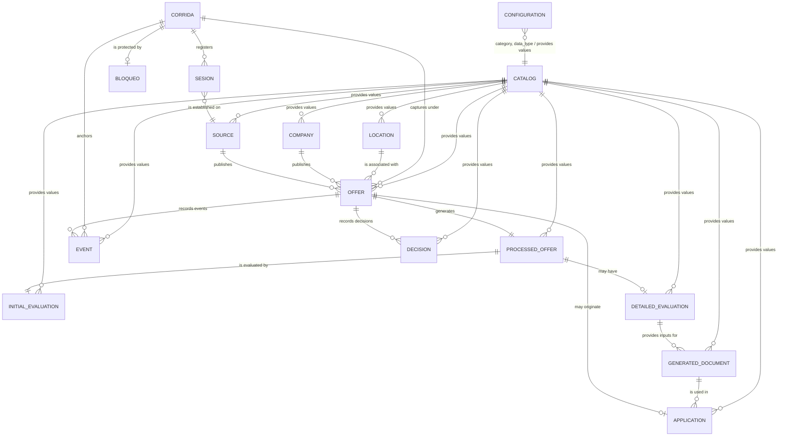

# Document 13A - Detailed Data Model Design

## 1. Official Entity Inventory

Official record of all persistent entities in the job search automation data model.

| Entity | Category | Functional Domain | Description |
| --- | --- | --- | --- |
| Offer | Main | Opportunity Discovery | Job offer identified by the automation during search. |
| Source | Main | Opportunity Discovery | Origin from which a job offer is obtained. |
| Company | Main | Opportunity Discovery | Organization that publishes the job offer. |
| Location | Support | Opportunity Discovery | Geographic information associated with a job offer. |
| Processed Offer | Main | Offer Processing | Structured and normalized version of an offer after processing. |
| Initial Evaluation | Main | Initial Evaluation | Result of the initial evaluation of a job offer. |
| Detailed Evaluation | Main | Detailed Evaluation | Complete evaluation of an offer that passed the initial evaluation. |
| Generated Document | Operational | Document Generation | Documents automatically generated for an offer. |
| Application | Main | Application Management | Application process carried out for a job offer. |
| Event | Operational | Traceability | Relevant events occurring during automation processing. |
| Decision | Operational | Decision Model | Functional decisions made by the automation during offer processing. |
| Configuration | Support | Configuration | Configuration parameters used during execution. |
| Catalog | Support | References | Controlled values used by model entities. |
| Corrida | Operational | Traceability | Execution instance (run) of the Discovery (Module 1), Preparation (Module 2) module, or of the scheduled run (transversal orchestrator); all module records anchor to its `id_corrida` (RN-01). |
| Sesion | Operational | Traceability | Audit of each platform session used by the Discovery module (Module 1) during a run. |
| Bloqueo | Operational | Concurrency | Persistent lock guaranteeing a single active run across the whole pipeline (Modules 1 and 2, decisions D3 module 2 / D33). |

**Scope of implemented persistence** — decisions 2026-07-30 and 2026-08-07:  
The MVP database (`job_search.db`) persists only: `secuencia_ids`, `empresas`, `ubicaciones`, and `ofertas_descubiertas`. The Discovery module additionally defines `eventos`, `sesiones`, `corridas`, and `bloqueo` as tables in the same SQLite file (decision D2, 2026-08-07). Remaining entities are deferred to later modules. This note formalizes the implemented scope; the full inventory remains the target model. **As-built D31 (2026-08-18):** the `fuentes` table was dropped from the physical model (never populated; sources are config-driven via `config.yaml`); the physical DB now has 8 tables. **As-built D32 (2026-08-19):** the physical table `ofertas` was renamed to `ofertas_descubiertas` to distinguish it from the offer tables of later stages (Preparation, Evaluation, Processing); prefix `OFE`, indexes and function names unchanged. **As-built D33 (2026-08-20):** Module 2 (Preparation) populates `empresas` and `ubicaciones` catalogs; adds `ubicacion_nombre`, `modalidad`, and `id_duplicidad` to `ofertas_descubiertas`; re-adds `id_oferta` to `eventos`; extends `corridas` with `total_preparadas` and `total_duplicadas`.

## 2. Detailed Specification of Entities

Each entity is specified with: description/purpose, attributes, primary key, alternate keys, foreign keys, relationships, constraints, state machine, and observations. Full attribute metadata — type, requirement, defaults, domains, sensitivity, persistence, actual implementation names — is in §5.

Specification order: Offer, Source, Company, Location, Processed Offer, Initial Evaluation, Detailed Evaluation, Generated Document, Application, Event, Decision, Configuration, Catalog, Corrida, Sesion, Bloqueo.

### 2.1. Entity: Offer

**Description/purpose:** Represents each job opportunity identified during discovery. Main entity of the model. Stores original offer information before normalization, evaluation, or document generation, and preserves the official reference throughout its lifecycle.

**Attributes:** `id`, `fuente_id`, `company_id`, `location_id`, `id_corrida`, `id_sesion`, `indice_set`, `id_externo`, `fecha_ultima_verificacion`, `enlace`, `title`, `original_description`, `publication_date`, `fecha_descubrimiento`, `status`, `active`, `observations`, `fecha_creacion`, `update_date`, `ubicacion_nombre`, `modalidad`, `id_duplicidad`.

**Primary key:** `id`.  
**Alternate keys:** None.  
**Foreign keys:** `fuente_id → Source`; `company_id → Company`; `location_id → Location`; `id_corrida → Corrida`; `status → Catalog`.  
MVP capture deviation (D4, 2026-08-09): `fuente_id` is stored as a raw `fuente_id` string without FK constraint; `empresa_id` and `ubicacion_id` may be `NULL`. **As-built D31 (2026-08-18):** `identificador_origen` was removed from the physical model (dead duplicate of `id_externo`); `empresa_id`/`ubicacion_id` store the placeholder `'N/A'` instead of `NULL` when the company/location is unknown (no-empty-field rule, D31 — supersedes D4/D29 on those columns; catalogs remain unpopulated, PMD-021).

**Relationships:** belongs to Source N:1; captured by Corrida N:1; published by Company N:1; located in Location N:1; generates Processed Offer 1:1; evaluated by Initial Evaluation 1:1; may generate Detailed Evaluation 1:0..1; may generate Generated Document 1:N; may originate Application 1:0..1; records Event 1:N; records Decision 1:N.

**Constraints:**
- Every offer belongs to a single source.
- Every offer is associated with a single company.
- The offer URL is preserved throughout its lifecycle.
- Original offer content must not be overwritten after discovery.
- Offer status follows the official state machine.
- Discovery module records new offers with status `descubierta` (decision C5, 2026-08-07); other transitions belong to Processing module 2. **As-built D33 (2026-08-20):** Module 2 introduces the transitions `descubierta → preparada` (Nodo 2 — Preparación de ofertas) and `preparada → duplicada` (Nodo 3 — Verificación de duplicidad); `duplicada` is the 8th state of the `estado` CHECK; the company's `empresa_id` and the location's `ubicacion_id` are populated by Module 2 (previously `NULL`/`N/A` under D4/D29/PMD-021).
- `company_name` and `location_name` raw-string columns were **dropped from the physical model** — decision D29 (2026-08-17): Module 1 no longer extracts company/location from the cards; the offer's relation to Company/Location is exclusively via `empresa_id`/`ubicacion_id` (catalogs remain unpopulated in the MVP, D4/PMD-021).
- `id_externo` is an external source identifier, best effort (`identificador_origen` was removed from the physical model as a dead duplicate — D31).
- Registration deduplicates by `id_externo` via upsert; each dedup hit refreshes `fecha_ultima_verificacion` (D4).
- No-empty-field rule (D31, 2026-08-18): `descripcion_original`, `fecha_publicacion`, `observaciones`, `empresa_id` and `ubicacion_id` store `'N/A'` when the value is not applicable/available — never `''` or NULL. `fecha_ultima_verificacion` is exempted: empty until a re-visit refreshes it (user instruction, D31 point 4).
- **As-built D33 (2026-08-20):** the Verification node of Module 2 reuses `fecha_ultima_verificacion` as the **duplicate-verification marker** — `''` means pending verification and is written only by that node when an offer finishes being checked. Module 1's upsert keeps refreshing the column on dedup hits. Both writers are correct within their module; the column carries the timestamp of the most recent writer (dual semantics documented).

**State machine:** Official offer state machine applies; detailed specification is documented in the corresponding section.

**Observations:** Entry point of the data model and main reference for all derived processing, evaluation, and application entities.

### 2.2. Entity: Source

**Description/purpose:** Represents each origin from which offers are discovered: platform, website, job portal, corporate page, or authorized means. Centralizes origin information, provenance, and source-specific characteristics.

**Attributes:** `id`, `name`, `type`, `main_url`, `description`, `active`, `query_frequency`, `last_query`, `last_update`, `observations`, `fecha_creacion`, `update_date`.

**Primary key:** `id`.  
**Alternate keys:** None.  
**Foreign keys:** `type → Catalog`; `query_frequency → Catalog`.

**Relationships:** publishes Offer 1:N.

**Constraints:**
- Source name is unique.
- `main_url` uniquely identifies the source.
- `active` is a catalog attribute for external administration; Discovery does not filter sources by it at runtime (decision D1, 2026-08-07).
- Source type must be a valid official catalog value.

**State machine:** Not applicable.

**Observations:** Represents only the origin of offers; it does not store individual offer data. **As-built D31 (2026-08-18):** the `fuentes` table was **dropped from the physical model** — it was never populated in production (sources are config-driven via `config.yaml` and the `Source` model is never stored); the entity remains in the target model for future modules (catalog persistence). `ofertas_descubiertas.fuente_id` keeps storing the config `fuente_id` string (D4).

### 2.3. Entity: Company

**Description/purpose:** Represents the organization responsible for publishing one or more offers. Centralizes company information and avoids duplication when the same organization publishes multiple offers or uses different sources.

**Attributes:** `id`, `name`, `nombre_normalizado`, `website`, `linkedin`, `sector`, `size`, `description`, `observations`, `fecha_creacion`, `update_date`.

**Primary key:** `id`.  
**Alternate keys:** None.  
**Foreign keys:** `sector → Catalog`; `size → Catalog`.

**Relationships:** publishes Offer 1:N.

**Constraints:**
- `nombre_normalizado` is used to minimize duplicate companies.
- A company may be associated with multiple offers.
- A company may appear in multiple sources without generating duplicate records.
- Sector and size must use official catalog values when used.

**State machine:** Not applicable.

**Observations:** Represents only the organization offering the vacancy. The same company may publish multiple offers over time and through different sources while maintaining a single record. **As-built D33 (2026-08-20):** Module 2 (Preparation — Nodo 2) populates this catalog via upsert by `nombre_normalizado` (no AI); the deep enrichment of `sitio_web`, `sector`, `tamano` and `descripcion` is decoupled from the critical path (decision D4) and runs as step 6 of Finalizar Proceso, controlled by `preparacion.profundidad_catalogo_empresa`.

### 2.4. Entity: Location

**Description/purpose:** Represents the geographic location associated with a job offer. Stores normalized location information to avoid duplication when multiple offers share the same place.

**Attributes:** `id`, `ciudad`, `region`, `pais`, `fecha_creacion`, `fecha_ultima_edicion`. (`address`, `modality`, `location_type` and `observations` belong to the target model and are not implemented in the physical table — `modalidad` was removed in D33.)

**Primary key:** `id`.  
**Alternate keys:** None.  
**Foreign keys:** Not applicable.

**Relationships:** is used by Offer 1:N.

**Constraints:**
- Deduplication is by the **full normalized tuple** `(ciudad, region, pais)`; there is no individual mandatory component.
- Each component stores `'N/A'` when the source did not provide it (e.g. "Colombia" alone → `(N/A, N/A, Colombia)` with a single shared id).
- "Remoto" / not-reported offers do not create a location row — the offer's `ubicacion_id` is set to `'N/R'` (not-required).
- Geographic coordinates may be stored only when available and consistent with the registered location (target model; not implemented in the physical table).

**State machine:** Not applicable.

**Observations:** Work modality is a property of the **offer**, not of the location — it moved to `ofertas_descubiertas.modalidad` (D33), so the location table no longer carries that column.

### 2.5. Entity: Processed Offer

**Description/purpose:** Structured, normalized, and enriched version of an offer after processing. Enables evaluation, comparison, document generation, and decision-making while preserving the original offer unchanged.

**Attributes:** `id`, `id_oferta`, `normalized_position`, `processed_description`, `summary`, `technical_skills`, `soft_skills`, `technologies`, `experience_level`, `education_level`, `contract_type`, `work_modality`, `salary_range`, `languages`, `benefits`, `requirements`, `responsibilities`, `fecha_procesamiento`, `processing_version`, `observations`, `fecha_creacion`, `update_date`.

**Primary key:** `id`.  
**Alternate keys:** `id_oferta`.  
**Foreign keys:** `id_oferta → Offer`; `experience_level → Catalog`; `education_level → Catalog`; `contract_type → Catalog`; `work_modality → Catalog`.

**Relationships:** generated from Offer 1:1; used by Initial Evaluation 1:1; may be used by Detailed Evaluation 1:0..1; serves as input for Generated Document 1:N.

**Constraints:**
- Each processed offer is associated with a single original offer.
- At most one processed offer exists per offer.
- Processed information must not replace or modify original Offer content.
- Catalog-classified values must use official project values.

**State machine:** Not applicable.

**Observations:** Basis for evaluation and document generation. Recorded deviations (PMD-020): `requisitos`, `tecnologias`, and `idiomas` are implemented as JSON lists instead of `Long Text`; `summary`, `technical_skills`, and `soft_skills` are not implemented in `shared/models.py`.

### 2.6. Entity: Initial Evaluation

**Description/purpose:** Result of the first evaluation performed on a processed offer. Determines whether the offer proceeds to detailed evaluation or is discarded, preserving decision traceability.

**Attributes:** `id`, `id_oferta_procesada`, `result`, `score`, `pass_threshold`, `decision`, `justificacion`, `criterios_evaluados`, `observations`, `fecha_evaluacion`, `version_modelo`, `fecha_creacion`, `update_date`.

**Primary key:** `id`.  
**Alternate keys:** `id_oferta_procesada`.  
**Foreign keys:** `id_oferta_procesada → Processed Offer`; `result → Catalog`; `decision → Catalog`.

**Relationships:** evaluates Processed Offer 1:1; may generate Detailed Evaluation 1:0..1; records Decision 1:N; records Event 1:N.

**Constraints:**
- Each initial evaluation is associated with a single processed offer.
- At most one initial evaluation exists per processed offer.
- `result` must be a valid official catalog value.
- `decision` must correspond to the evaluation result.
- Score, threshold, and justificacion used for decision-making must be preserved.

**State machine:** Not applicable.

**Observations:** First objective filter. Its result determines continuation or termination of processing while preserving decision traceability.

### 2.7. Entity: Detailed Evaluation

**Description/purpose:** Result of the in-depth diagnosis performed on an offer that passed initial evaluation. Corresponds to Phase 1 — Diagnosis of the vacancy for cover letter construction. Records the analysis and the fit between the organization’s needs and the user’s professional profile.

**Attributes:** `id`, `id_oferta_procesada`, `resultado_organizacional`, `problema_organizacional`, `perfil_profesional_requerido`, `coincidencias_perfil`, `logica_xyz`, `hipotesis_valor`, `informacion_descartada`, `ajuste_tecnico`, `justificacion_ajuste_tecnico`, `ajuste_funcional`, `justificacion_ajuste_funcional`, `ajuste_estrategico`, `justificacion_ajuste_estrategico`, `riesgo_sobrecalificacion`, `justificacion_riesgo`, `recomendacion_final`, `justificacion_recomendacion`, `insumos_carta_presentacion`, `fecha_evaluacion`, `version_metodologia`, `fecha_creacion`, `update_date`.

**Primary key:** `id`.  
**Alternate keys:** `id_oferta_procesada`.  
**Foreign keys:** `id_oferta_procesada → Processed Offer`; `riesgo_sobrecalificacion → Catalog`; `recomendacion_final → Catalog`.

**Relationships:** evaluates Processed Offer 1:1; provides inputs for Generated Document 1:N; may originate Application 1:0..1; records Decision 1:N; records Event 1:N.

**Constraints:**
- Each detailed evaluation is associated with a single processed offer.
- At most one detailed evaluation exists per processed offer.
- Only offers that passed initial evaluation may undergo detailed evaluation.
- Fit scores use a 0–10 scale.
- `riesgo_sobrecalificacion` must be an official catalog value.
- `recomendacion_final` must be an official catalog value.
- Every recorded conclusion must maintain traceability with evidence from the job offer, resume, and professional portfolio.

**State machine:** Not applicable.

**Observations:** Stores the complete Phase 1 diagnosis deliverables so later phases can consume the analysis without reconstructing it.

### 2.8. Entity: Generated Document

**Description/purpose:** Represents each document automatically produced from processing and evaluating an offer. Controls lifecycle, version history, and later retrieval.

**Attributes:** `id`, `id_oferta`, `detailed_evaluation_id`, `document_type`, `document_name`, `version`, `content`, `format`, `status`, `generation_date`, `last_modified_date`, `observations`, `fecha_creacion`, `update_date`.

**Primary key:** `id`.  
**Alternate keys:** None.  
**Foreign keys:** `id_oferta → Offer`; `detailed_evaluation_id → Detailed Evaluation`; `document_type → Catalog`; `format → Catalog`; `status → Catalog`.

**Relationships:** generated for Offer N:1; based on Detailed Evaluation N:1; may be used in Application 1:N.

**Constraints:**
- Every document is associated with a single offer.
- Every document requires a previously completed detailed evaluation.
- Document type, format, and status must be valid official catalog values.
- Each document version must preserve traceability.

**State machine:** Official document-management state machine applies; detailed specification is documented in the corresponding section.

**Observations:** Manages all documents independently of type, supporting future document types without structural changes.

### 2.9. Entity: Application

**Description/purpose:** Represents the process through which the user applies to an offer using generated documents. Records and manages the complete application lifecycle up to the final selection result.

**Attributes:** `id`, `id_oferta`, `main_document_id`, `application_date`, `application_channel`, `status`, `company_response`, `response_date`, `next_action`, `next_action_date`, `observations`, `fecha_creacion`, `update_date`.

**Primary key:** `id`.  
**Alternate keys:** None.  
**Foreign keys:** `id_oferta → Offer`; `main_document_id → Generated Document`; `application_channel → Catalog`; `status → Catalog`.

**Relationships:** corresponds to Offer N:1; uses Generated Document N:1; records Event 1:N; may record Decision 1:N.

**Constraints:**
- Every application is associated with a single offer.
- Every application uses at least one automation-generated document.
- Application channel and status must be valid official catalog values.
- Every application status modification must preserve traceability.

**State machine:** Official application-process state machine applies; detailed specification is documented in the corresponding section.

**Observations:** Tracks the complete application process, not only submission, including evolution and closure.

### 2.10. Entity: Event

**Description/purpose:** Represents each relevant fact occurring during automation execution: action, state change, process execution, error, or occurrence preserved for traceability, auditing, and diagnostics.

**Attributes:** `id`, `id_corrida`, `fuente_id`, `id_sesion`, `indice_set`, `tipo`, `codigo`, `evidencia`, `event_type`, `affected_entity`, `entity_id`, `action`, `description`, `result`, `origin`, `context`, `event_date`, `fecha_creacion`.

**Primary key:** `id`.  
**Alternate keys:** None.  
**Foreign keys:** `id_corrida → Corrida`; `fuente_id → Source`; `event_type → Catalog`; `tipo → Catalog`; `action → Catalog`; `result → Catalog`; `origin → Catalog`.

**Relationships:** records events of Offer N:1; anchored to Corrida N:1; may be associated with Decision N:0..1; may record Application N:0..1.

**Constraints:**
- In module 1, every event must be associated with a `id_corrida`.
- `id_oferta` is required only when the event belongs to a specific offer. **As-built D31 (2026-08-18):** `id_oferta` was **removed from the physical model** — Module 1 never wrote it (per-offer event traceability is not implemented; the column had no FK constraint and no writer). **As-built D33 (2026-08-20):** `id_oferta` is **re-added** (default `'N/A'`) so that Module 2 can attribute its per-offer events (`oferta_preparada`, `preparacion_fallida`, `oferta_duplicada`, `revision_pendientes`) to the offer. Module-level events and orchestration events keep `id_oferta = 'N/A'`; per-offer events of Module 2 carry the real id. No FK constraint is enforced at the physical level.
- No-empty-field rule (D31, 2026-08-18): `fuente_id`, `id_sesion`, `indice_set` and `evidencia` store `'N/A'` when not applicable (e.g. run-level events) — never `''` or NULL; `indice_set` keeps `0` as a valid value.
- Every event must record the exact moment it occurred.
- Every module 1 event must record `tipo` — `error` or `suceso` — and, when applicable, `codigo` from the Discovery module technical sheet.
- `event_type`, `action`, `result`, and `origin` must use valid official catalog values.
- Events cannot be deleted once recorded.
- Events must be preserved to guarantee traceability.

**State machine:** Not applicable.

**Observations:** Chronological history of the automation. In Discovery module 1, events additionally record origin run `id_corrida`, typology `tipo`, and business `codigo` (`ERR-nn`, `EVT-nn`).

### 2.11. Entity: Decision

**Description/purpose:** Represents each decision made by the automation during offer processing after applying business rules, evaluation criteria, or analysis processes. Preserves reasoning and traceability.

**Attributes:** `id`, `id_oferta`, `stage`, `decision_type`, `decision`, `justificacion`, `evidence`, `confidence`, `origin_component`, `decision_date`, `observations`, `fecha_creacion`.

**Primary key:** `id`.  
**Alternate keys:** None.  
**Foreign keys:** `id_oferta → Offer`; `stage → Catalog`; `decision_type → Catalog`; `origin_component → Catalog`.

**Relationships:** records decisions of Offer N:1; may originate Event 1:N; may be associated with Initial Evaluation N:0..1; may be associated with Detailed Evaluation N:0..1; may influence Application N:0..1.

**Constraints:**
- Every decision is associated with an offer.
- Justification is mandatory.
- Evidence used to support the decision must be preserved.
- Stage, decision type, and origin component must use valid official catalog values.
- Decisions cannot be deleted once recorded.

**State machine:** Not applicable.

**Observations:** Formal record of automation decisions: what was decided, why, with what evidence, and at what stage.

### 2.12. Entity: Configuration

**Description/purpose:** Represents parameters controlling automation behavior during execution without modifying implementation.

**Attributes:** `id`, `category`, `name`, `description`, `value`, `data_type`, `default_value`, `required`, `editable`, `active`, `observations`, `fecha_creacion`, `update_date`.

**Primary key:** `id`.  
**Alternate keys:** `name`.  
**Foreign keys:** `category → Catalog`; `data_type → Catalog`.

**Relationships:** uses values from Catalog N:1.

**Constraints:**
- Parameter name is unique within the system.
- Every parameter belongs to a catalog-defined category.
- `data_type` must be a valid catalog value.
- Stored value must be compatible with the defined data type.
- Required parameters must always have a valid value.

**State machine:** Not applicable.

**Observations:** Decouples automation logic from operational values, enabling adaptation without changing the data model or code.

### 2.13. Entity: Catalog

**Description/purpose:** Represents controlled value sets used by model entities to normalize information, prevent inconsistent values, and maintain reference lists.

**Attributes:** `id`, `catalog_name`, `code`, `name`, `description`, `order`, `active`, `observations`, `fecha_creacion`, `update_date`.

**Primary key:** `id`.  
**Alternate keys:** `catalog_name + code`.  
**Foreign keys:** Not applicable.

**Relationships:** used by Offer, Source, Company, Location, Processed Offer, Initial Evaluation, Detailed Evaluation, Generated Document, Application, Event, Decision, and Configuration — 1:N each.

**Constraints:**
- Each `catalog_name + code` combination is unique.
- Inactive values cannot be used in new records.
- Codes must remain stable to preserve compatibility.
- Physical deletion of values used by other entities is not permitted.

**State machine:** Not applicable.

**Observations:** Central repository for controlled values, including but not limited to: offer statuses, source types, work modalities, contract types, experience levels, education levels, business sectors, company sizes, document types, document statuses, application statuses, event types, decision types, configuration categories, and future controlled value sets.

### 2.14. Entity: Corrida

**Description/purpose:** Execution instance (run) of the Discovery (Module 1), Preparation (Module 2) module, or of the scheduled run (transversal orchestrator). Created at startup, acquires the persistent lock, processes its workload, and ends with a termination motive. Every module record anchors to its `id_corrida`.

**Attributes:** `id`, `id_corrida`, `fecha_inicio`, `fecha_fin`, `estado`, `motivo_terminacion`, `total_ofertas`, `total_sucesos`, `total_errores`, `fuentes_procesadas`, `total_preparadas`, `total_duplicadas`. (As-built 2026-08-14, decision D25: the closure attributes — `motivo_terminacion` and the four SQL-computed metrics — were already present in the physical table and are now enforced by the Pydantic model `Corrida` with `extra="forbid"`. As-built D33, 2026-08-20: `total_preparadas` and `total_duplicadas` are added for Module 2; default `0`; metrics-by-events semantics from the Verification node.)

**Primary key:** `id`.  
**Alternate keys:** `id_corrida` — unique.  
**Foreign keys:** `estado → Catalog`.

**Relationships:** captures Offer 1:N; anchors Event 1:N; registers Sesion 1:N; protected by Bloqueo 1:0..1.

**Constraints:**
- `id_corrida` is unique within the system.
- Every record generated by the module — errors, success events, sessions, offers — must reference its `id_corrida`.

**State machine:** Run statuses and transitions are defined by each module's technical sheet — Discovery (INICIO / Finalizar Proceso), Preparation (INICIO / Finalizar Proceso) and the transversal orchestrator (Corrida programada — lanzar y supervisar módulos). `EstadoCorrida` values: `en_ejecucion`, `completada`, `sin_fuentes`, `sin_pendientes`, `abortada` (the last two added by Module 2 — D33; `sin_pendientes` is the new value for runs that had nothing to process).

**Observations:** Physical table: `corridas` (decision D2, 2026-08-07).

### 2.15. Entity: Sesion

**Description/purpose:** Audit record of a platform session successfully established by the Discovery module. Records essential audit data only; it does not store credentials, tokens, or cookies.

**Attributes:** `id`, `id_sesion`, `id_corrida`, `fuente_id`, `indice_set`, `marca_temporal`, `total_declarado`, `conteo`, `estado`.

**Primary key:** `id`.  
**Alternate keys:** `(id_sesion, indice_set)` per source.  
**Foreign keys:** `id_corrida → Corrida`; `fuente_id → Source`.

**Relationships:** registered by Corrida N:1; established on Source N:1.

**Constraints:**
- A session record is created only after successful entry (decision D3); failed attempts are reported as events, not sessions.
- Sessions record only essential audit fields.

**State machine:** Not applicable.

**Observations:** The technical sheet mentions additional audit fields — e.g., `conteo_primera_pagina`, `hay_mas_paginas`, `coherencia`, `estado_auditoria`; the MVP limits itself to essential fields per decision D3.

### 2.16. Entity: Bloqueo

**Description/purpose:** Persistent concurrency lock for the whole pipeline: at most one active run at a time across Modules 1 and 2.

**Attributes:** `id`, `id_corrida`, `marca_temporal`, `umbral_obsolescencia`, `estado`.

**Primary key:** `id`.  
**Alternate keys:** None.  
**Foreign keys:** `id_corrida → Corrida`.

**Relationships:** protects Corrida 1:0..1.

**Constraints:**
- At most one record with `estado = activo` across the whole pipeline (single active run — Module 1 and Module 2 share the same lock).
- If an active lock's `marca_temporal` is older than `umbral_obsolescencia`, a new run may take over the lock as obsolete.

**State machine:** Not applicable.

**Observations:** `umbral_obsolescencia` is centralized in the system configuration file; no hardcoded values.

### 2.17. Data management rules (D31, 2026-08-18)

Fundamental rules applicable to all persisted data from this decision onward:

- **No empty fields:** no persisted field may hold `''` or NULL as "no value". When a value is not applicable or not available, the placeholder is `N/A` (not-applicable) or `N/R` (not-required). Implemented at the persistence boundary (`shared/persistence.py`): `escribir_evento` normalizes `fuente_id`/`id_sesion`/`indice_set`/`evidencia` and `_upsert_ofertas_en` normalizes `descripcion_original`/`fecha_publicacion`/`observaciones`/`empresa_id`/`ubicacion_id` (empty/None → `'N/A'`; `indice_set` only when `is None`, since `0` is a valid set index); affected columns declare `DEFAULT 'N/A'` in the schema.
- **Exclusions:** `ofertas_descubiertas.id_externo` (a `'N/A'` value would collide during dedup — registration deduplicates by `id_externo`) and `ofertas_descubiertas.fecha_ultima_verificacion` (explicitly exempted by the user, D31 point 4: empty until a re-visit refreshes it).
- **Scope:** currently enforced on `ofertas_descubiertas` and `eventos`. `corridas`, `sesiones`, `bloqueo`, `empresas`, `ubicaciones` and `secuencia_ids` are not restructured (their columns are either always complete or reserved); the rule applies to any future modification or new entity. **As-built D33 (2026-08-20):** the rule extends to the Module 2 additions — `ofertas_descubiertas.ubicacion_nombre`/`modalidad` and the re-added `eventos.id_oferta` all declare `DEFAULT 'N/A'`; `ubicaciones` components (`ciudad`, `region`, `pais`) store `'N/A'` when not provided; the new `corridas.total_preparadas`/`total_duplicadas` columns default to `0`.
- **Query semantics:** value-counting queries treat `'N/A'` as empty — `contar_distintos` excludes NULL, `''` and `'N/A'` (keeps `fuentes_procesadas` correct, since run-level events carry `fuente_id='N/A'`).
- **Physical cleanup (D31):** the `fuentes` table and the `FNT-` prefix, `ofertas_descubiertas.identificador_origen` and `eventos.id_oferta` are removed from the physical model; migration `_migrate_limpieza_d31` is idempotent (`DROP TABLE IF EXISTS`, guarded `ALTER TABLE ... DROP COLUMN`, backfill).
- **Re-addition (D33):** `eventos.id_oferta` is re-added (default `'N/A'`) so that Module 2 per-offer events can carry the offer id; module-level and orchestration events keep `id_oferta = 'N/A'`.

## 3. Catalogs and Reference Tables

Catalogs are controlled value sets used through foreign keys to guarantee consistency, integrity, and normalization.

**Deferral** — decision 2026-07-30: the Catalog entity is not implemented in the MVP. Current implementation — `shared/models.py`, `shared/persistence.py` — stores catalog values as free text. Formal Catalog entity adoption is deferred to modules introducing traceability — Modules 2–3 onward. Only Offer Statuses catalog, §3.1, is enforced in the MVP via `shared/state_machine.py`.

| § | Catalog | Purpose | Initial values and notes |
| --- | --- | --- | --- |
| 3.1 | Offer Statuses | Define offer lifecycle states. | `descubierta`, `preparada`, `evaluada`, `aceptada`, `descartada`, `procesada`, `finalizada`. Official 7-status source of truth, aligned with `shared/state_machine.py` and DOC-01 §13; previous 12-value versions are superseded. |
| 3.2 | Source Types | Classify offer origins. | `Job portal`, `Corporate page`, `LinkedIn`, `Recruitment agency`, `Referral`, `Other`. |
| 3.3 | Work Modalities | Classify vacancy execution modality. | `On-site`, `Remote`, `Hybrid`. |
| 3.4 | Contract Types | Classify contractual modality. | `Permanent`, `Fixed term`, `Temporary`, `Service provision`, `Freelance`, `Internship`, `Not specified`. |
| 3.5 | Experience Level | Classify required experience. | `No experience`, `Junior`, `Mid-Senior`, `Senior`, `Lead`, `Managerial`, `Not specified`. |
| 3.6 | Education Level | Classify required academic level. | `High school`, `Technical`, `Associate`, `Bachelor's`, `Specialization`, `Master's`, `Doctorate`, `Not specified`. |
| 3.7 | Business Sectors | Classify company economic sector. | `Technology`, `Manufacturing`, `Healthcare`, `Education`, `Financial`, `Retail`, `Consulting`, `Government`, `Other`. |
| 3.8 | Company Size | Classify organization size. | `Micro-enterprise`, `Small`, `Medium`, `Large`, `Multinational`, `Not specified`. |
| 3.9 | Document Types | Classify generated documents. | `Cover Letter`, `Resume`, `Application email`, `Supporting document`, `Other`. |
| 3.10 | Document Statuses | Control document lifecycle. | `Generated`, `Reviewed`, `Approved`, `Used`, `Archived`. |
| 3.11 | Application Channels | Classify application means. | `Job portal`, `Corporate page`, `LinkedIn`, `Email`, `Other`. |
| 3.12 | Application Statuses | Record application evolution. | `Pending`, `Sent`, `Under review`, `Interview`, `Technical test`, `Offer received`, `Rejected`, `Withdrawn`, `Completed`. |
| 3.13 | Event Types | Classify recorded events. | `Discovery`, `Processing`, `Evaluation`, `Document generation`, `Application`, `Update`, `Error`, `Warning`, `Information`. In Discovery module 1, each event is additionally classified by Event.`tipo`: `error` or `suceso` — decision 2026-08-07. |
| 3.14 | Decision Types | Classify automation decisions. | `Approval`, `Rejection`, `Continue processing`, `Stop processing`, `Generate document`, `Apply`, `Archive`. |
| 3.15 | Overqualification Risk | Classify detailed-evaluation overqualification risk. | `Bajo`, `Medio`, `Alto`. |
| 3.16 | Final Recommendation | Record detailed-evaluation final recommendation. | `Aplicar`, `Aplicar con reservas`, `No aplicar`. |

## 4. Logical Data Model

Defines entities, relationships, and organization rules independently of implementation technology.

### 4.1. Main entities

Offer, Source, Company, Location, Processed Offer, Initial Evaluation, Detailed Evaluation, Generated Document, Application, Event, Decision, Configuration, Catalog, Corrida, Sesion, Bloqueo.

### 4.2–4.3. Relationships and cardinalities

| Relationship | Cardinality |
| --- | --- |
| Source → Offer | 1:N |
| Company → Offer | 1:N |
| Location → Offer | 1:N |
| Offer → Processed Offer | 1:1 |
| Processed Offer → Initial Evaluation | 1:1 |
| Processed Offer → Detailed Evaluation | 1:0..1 |
| Detailed Evaluation → Generated Document | 1:N |
| Offer → Event | 1:N |
| Offer → Decision | 1:N |
| Offer → Application | 1:0..1 |
| Generated Document → Application | 1:N |
| Corrida → Offer | 1:N |
| Corrida → Event | 1:N |
| Corrida → Sesion | 1:N |
| Corrida → Bloqueo | 1:0..1 |
| Source → Sesion | 1:N |

### 4.4. Logical flow

Main information flow:

`Source → Offer → Processed Offer → Initial Evaluation → Detailed Evaluation → Generated Document → Application`

Event and Decision record traceability throughout the process. Catalog and Configuration provide supporting controlled values and operational parameters. During Discovery — module 1 — each Corrida anchors Offers, Events, and Sesiones via `id_corrida`, and is protected by Bloqueo while active.

### 4.5. Model integrity

The model must guarantee:
- Referential integrity across all relationships.
- No orphan entities.
- Every main entity is traceable to the originating offer.
- Every Discovery-module record — offers, events, sessions — is traceable to its run via `id_corrida` — RN-01.
- Original offer information remains unchanged throughout processing.
- Processing traceability is fully reconstructible from entity relationships.

### 4.6. Model evolution

Any Logical Data Model modification must:
- Maintain compatibility with official project versions.
- Update the Official Data Dictionary.
- Update the Entity–Relationship Diagram.
- Maintain consistency with Document 13 architecture.

## 5. Official Data Dictionary

Official technical reference for all model attributes.

### 5.1. Dictionary structure

Each attribute documents, at minimum: Entity, Attribute, Description, Logical type, Required, Primary key, Alternate key, Foreign key, Default value, Domain, Constraints, Sensitivity, Persistence, Observations.

### 5.2. Coverage

The dictionary includes all attributes of: Offer, Source, Company, Location, Processed Offer, Initial Evaluation, Detailed Evaluation, Generated Document, Application, Event, Decision, Configuration, Catalog, Corrida, Sesion, Bloqueo. Implemented attributes not documented here are not permitted.

**Common audit fields:**  
For entities §5.5.1–5.5.13, unless otherwise specified:
- `fecha_creacion` — Record creation timestamp. Date/Time; required. Sensitivity Internal; Persistence Permanent.
- `update_date` — Last record update timestamp. Date/Time; required. Sensitivity Internal; Persistence Permanent. Actual name is `fecha_ultima_edicion` for Offer, Source, Company, Location, Processed Offer, and Initial Evaluation; no actual name is noted for Detailed Evaluation, Generated Document, Application, Configuration, and Catalog.

Event and Decision include only `fecha_creacion`. Corrida, Sesion, and Bloqueo use only their listed temporal fields.

### 5.3. Consistency

Any attribute modification must be reflected consistently in:
- Entity specification.
- Logical Data Model.
- ERD, if structure is affected.

The Official Data Dictionary is the technical reference for database implementation.

### 5.4. Change control

Any addition, modification, or deletion of attributes must update this dictionary before being considered an official model version. Documented information must remain synchronized with project technical documentation.

### 5.5. Attribute catalog

#### 5.5.1. Offer

- `id` — Unique identifier. UUID; required; PK. Sensitivity Internal; Permanent. Actual name: `id`.
- `fuente_id` — Reference to the source where the offer was discovered. UUID; required; FK Source. Constraint: mandatory source. Internal; Permanent. Actual name: `fuente_id`; MVP stores raw `fuente_id` string without FK constraint — D4.
- `company_id` — Reference to the company publishing the offer. UUID; logically mandatory association; FK Company. Constraint: mandatory company. Internal; Permanent. Actual name: `empresa_id`; MVP capture may be `NULL` — D4. **As-built D29 (2026-08-17):** Module 1 does not extract the company from the cards; the adapter writes `NULL` and the `empresas` catalog stays unpopulated (PMD-021). **As-built D31 (2026-08-18):** stores `'N/A'` when the company is unknown (no-empty-field rule; supersedes D4/D29 on this column). **As-built D33 (2026-08-20):** populated by Module 2 (Preparation — Nodo 2) via upsert by `nombre_normalizado`; stores the catalog id, or `'N/A'` if the offer page did not expose the company.
- `location_id` — Reference to the location associated with the offer. UUID; optional; FK Location. Public; Permanent. Actual name: `ubicacion_id`; MVP capture may be `NULL` — D4. **As-built D29 (2026-08-17):** Module 1 does not extract the location from the cards; the adapter writes `NULL` and the `ubicaciones` catalog stays unpopulated (PMD-021). **As-built D31 (2026-08-18):** stores `'N/A'` when the location is unknown (no-empty-field rule; supersedes D4/D29 on this column). **As-built D33 (2026-08-20):** populated by Module 2 (Nodo 2); stores the catalog id (UBI-xxxx), or `'N/R'` for "Remoto"/not-reported, or `'N/A'` for pending AI classification.
- `id_corrida` — Run that discovered the offer. UUID; optional; FK Corrida. Discovery traceability — RN-01. Internal; Permanent. Actual name: `id_corrida`. **As-built D33 (2026-08-20):** Module 2 does not overwrite this column — it always reflects the discovery run; the preparation traceability lives in `eventos`.
- `id_sesion` — Platform session used to discover the offer. UUID; optional; module 1. Internal; Permanent. Actual name: `id_sesion`.
- `indice_set` — Index of the filter set that produced the offer. Integer; optional; module 1. Internal; Permanent. Actual name: `indice_set`.
- `id_externo` — External identifier of the offer in the source of origin; best effort. Text; optional. Public; Permanent. Actual name: `id_externo`. **As-built D31 (2026-08-18):** `identificador_origen` was removed from the physical model as a dead duplicate; `id_externo` is the single dedup key (D4) and is excluded from the `N/A` normalization.
- `enlace` — Original offer link. Text; required. Constraint: preserved throughout lifecycle. Public; Permanent.
- `title` — Original offer title. Text; required. Public; Permanent. Actual name: `titulo`. **As-built D33 (2026-08-20):** Module 2 (Nodo 2) may overwrite this column best-effort with the `<h1>` of the offer page when one is available; otherwise the value from Module 1 is preserved.
- `original_description` — Original content obtained during discovery. Long Text; required. Constraint: must not be overwritten after discovery. Public; Permanent. Actual name: `descripcion_original`. **As-built D31 (2026-08-18):** stores `'N/A'` when no description is available (no-empty-field rule). **As-built D33 (2026-08-20):** Module 1 leaves this column at `'N/A'`; Module 2 (Nodo 2) populates it from the offer page (captured once — original content, not overwritten after preparation).
- `publication_date` — Publication date indicated by the source. Date/Time; optional. Public; Permanent. Actual name: `fecha_publicacion`. **As-built D28 (2026-08-17):** in Module 1 the value is an **approximate absolute timestamp** derived from the card's relative date "Publicado hace N <unidad>" (`FORMATO_TIMESTAMP`; precision ±1 h due to LinkedIn rounding; month unit = 30 days); the raw source text is preserved verbatim in `observations`. Normalization (Module 2) still applies on the raw text. **As-built D31 (2026-08-18):** stores `'N/A'` when the card has no relative date (no-empty-field rule).
- `fecha_descubrimiento` — Date/time when automation discovered the offer. Date/Time; required. Internal; Permanent.
- `status` — Current offer status in the processing flow. Catalog; required; FK Catalog. Default: `descubierta`. Domain: Offer Statuses — 8 values (`descubierta`, `preparada`, `duplicada`, `evaluada`, `aceptada`, `descartada`, `procesada`, `finalizada`; `duplicada` added by D33). Constraint: follows official state machine. Internal; Permanent. Actual name: `estado`.
- `active` — Indicates whether the offer remains valid. Boolean; required; default `true`. Internal; Permanent.
- `observations` — Additional relevant offer information. Long Text; optional. Internal; Permanent. Actual name: `observaciones`. **As-built D28 (2026-08-17):** carries the raw adapter text of the relative publication date (e.g. "Publicado hace 9 horas") captured during discovery. **As-built D31 (2026-08-18):** stores `'N/A'` when empty (no-empty-field rule). **As-built D33 (2026-08-20):** also stores the duplicate-detection evidence (e.g. "Duplicado de OFE-xxx — título 100 %, descripción 96 %") written by Module 2 Nodo 3.
- `fecha_ultima_verificacion` — Last re-visit timestamp of the listing. Date/Time; optional. Internal; Permanent. **As-built D31 (2026-08-18):** exempted from the `N/A` rule by explicit user instruction — empty until a dedup re-visit refreshes it. **As-built D33 (2026-08-20):** Module 2 reuses the column as the **duplicate-verification marker**; the Verification node (Nodo 3) is the only writer inside Module 2 (`''` = pending verification). Module 1's upsert keeps refreshing the column on dedup hits. Both writers are correct within their module; the column carries the timestamp of the most recent writer (dual semantics documented in `decision log.md` D33).
- `ubicacion_nombre` — Raw location text taken from the offer page by Module 2 (Nodo 2). Text; optional. Internal; Permanent. Actual name: `ubicacion_nombre`. **As-built D33 (2026-08-20):** column re-added (`DEFAULT 'N/A'`, D31 no-empty-field rule applies); reversión parcial justificada de D29 documentada en el decision log; preserva el texto crudo de la ubicación para su clasificación por IA y para la gestión posterior del lote (b) del nodo.
- `modalidad` — Work modality of the offer (on-site, remote, hybrid). Text; optional. Internal; Permanent. Actual name: `modalidad`. **As-built D33 (2026-08-20):** column re-added (`DEFAULT 'N/A'`); dato de la oferta (la IA no la toca); se clasifica sin IA en el Nodo 2.
- `id_duplicidad` — Reference to the original offer when this offer is a duplicate. UUID; optional; FK self (Offer). Internal; Permanent. Actual name: `id_duplicidad`. **As-built D33 (2026-08-20):** columna nueva (`DEFAULT 'N/A'`); la escribe el Nodo 3 de Verificación de duplicidad cuando confirma duplicado; el original queda intacto.

#### 5.5.2. Source

- `id` — Unique identifier. UUID; required; PK. Internal; Permanent. **As-built D31 (2026-08-18):** the Source entity has no physical table — the `fuentes` table was dropped (never populated; sources are config-driven). The entity remains in the target model; `ofertas_descubiertas.fuente_id` stores the config `fuente_id` string (D4).
- `name` — Official source name. Text; required. Constraint: unique name. Internal; Permanent. Actual name: `nombre`.
- `type` — Source type. Catalog; required; FK Catalog. Domain: Source Types. Constraint: valid catalog value. Internal; Permanent. Actual name: `tipo`.
- `main_url` — Main source URL. Text; required. Constraint: unique URL. Public; Permanent. Actual name: `enlace_base`.
- `description` — General source description. Long Text; optional. Internal; Permanent.
- `active` — Indicates whether source is enabled for discovery. Boolean; required; default `true`. Constraint: catalog attribute for external administration; Discovery does not filter by it at runtime — D1. Internal; Permanent. Actual name: `activa`.
- `query_frequency` — Configured query frequency. Catalog; optional; FK Catalog. Domain: Catalog. Constraint: valid catalog value. Internal; Permanent.
- `last_query` — Last query date/time. Date/Time; optional. Internal; Permanent.
- `last_update` — Last detected source update date/time, when determinable. Date/Time; optional. Internal; Permanent.
- `observations` — Additional relevant information. Long Text; optional. Internal; Permanent.

#### 5.5.3. Company

- `id` — Unique identifier. UUID; required; PK. Internal; Permanent.
- `name` — Official company name. Text; required. Public; Permanent. Actual name: `nombre`. **As-built D33 (2026-08-20):** populated by Module 2 (Nodo 2) via upsert by `nombre_normalizado`.
- `nombre_normalizado` — Standardized name used to avoid duplicates. Text; required. Internal; Permanent. **As-built D33 (2026-08-20):** the upsert key for Module 2 (Nodo 2); `normalizar_texto` from `shared/utilidades.py` produces it.
- `website` — Official website. Text; optional. Public; Permanent. Actual name: `sitio_web`. **As-built D33 (2026-08-20):** populated by the decoupled enrichment step (Nodo 5 paso 6) when `preparacion.profundidad_catalogo_empresa > 0` (D4).
- `linkedin` — Official LinkedIn profile URL. Text; optional. Public; Permanent. Actual name: `perfil_linkedin`. **As-built D33 (2026-08-20):** captured by Module 2 (Nodo 2) from the offer page.
- `sector` — Economic sector. Catalog; optional; FK Catalog. Domain: Business Sectors. Constraint: valid catalog value. Internal; Permanent. **As-built D33 (2026-08-20):** populated by the decoupled enrichment step (D4).
- `size` — Company size classification. Catalog; optional; FK Catalog. Domain: Company Size. Constraint: valid catalog value. Internal; Permanent. Actual name: `tamano`. **As-built D33 (2026-08-20):** populated by the decoupled enrichment step (D4).
- `description` — General company description. Long Text; optional. Public; Permanent. Actual name: `descripcion`. **As-built D33 (2026-08-20):** populated by the decoupled enrichment step (D4).
- `observations` — Additional relevant information. Long Text; optional. Internal; Permanent.

#### 5.5.4. Location

- `id` — Unique identifier. UUID; required; PK. Internal; Permanent. Actual name: `id`.
- `ciudad` — City of the vacancy. Text; optional. Public; Permanent. Actual name: `ciudad`. **As-built D33 (2026-08-20):** stores `'N/A'` when the source did not specify the city.
- `region` — State, province or department. Text; optional. Public; Permanent. Actual name: `region`. **As-built D33 (2026-08-20):** stores `'N/A'` when not provided.
- `pais` — Country where the vacancy is offered. Text; optional. Public; Permanent. Actual name: `pais`. **As-built D33 (2026-08-20):** dedup key component; stores `'N/A'` when the source did not specify the country (e.g. "Colombia" alone → `(N/A, N/A, Colombia)` shared across offers).
- `fecha_creacion` — Record creation timestamp. Date/Time; required. Sensitivity Internal; Permanent.
- `fecha_ultima_edicion` — Last record update timestamp. Date/Time; required. Sensitivity Internal; Permanent.
- **Dedup:** by full normalized tuple `(ciudad, region, pais)` — `normalizar_texto` produces the tuple. There is no individual mandatory component. "Remoto" → no row (the offer's `ubicacion_id` becomes `'N/R'`). `modalidad`/`address`/`location_type`/`observations` from the target model are not implemented in the physical table; `modalidad` moved to `ofertas_descubiertas.modalidad` (D33).

#### 5.5.5. Processed Offer

- `id` — Unique identifier. UUID; required; PK. Internal; Permanent.
- `id_oferta` — Reference to original offer. UUID; required; AK; FK Offer. Constraint: unique per offer. Internal; Permanent.
- `normalized_position` — Normalized position name. Text; required. Public; Permanent. Actual name: `titulo_limpio`.
- `processed_description` — Structured offer description. Long Text; required. Public; Permanent. Actual name: `descripcion_limpia`.
- `summary` — Generated summary. Long Text; optional. Internal; Permanent. Not implemented — PMD-020.
- `technical_skills` — Identified technical skills. Long Text; optional. Internal; Permanent. Not implemented — PMD-020.
- `soft_skills` — Identified soft skills. Long Text; optional. Internal; Permanent. Not implemented — PMD-020.
- `technologies` — Technologies identified during processing. Long Text; optional. Internal; Permanent. Implemented as JSON list — PMD-020. Actual name: `tecnologias`.
- `experience_level` — Required experience level. Catalog; optional; FK Catalog. Domain: Experience Level. Constraint: valid catalog value. Internal; Permanent.
- `education_level` — Identified education level. Catalog; optional; FK Catalog. Domain: Education Level. Constraint: valid catalog value. Internal; Permanent.
- `contract_type` — Identified contract type. Catalog; optional; FK Catalog. Domain: Contract Types. Constraint: valid catalog value. Internal; Permanent.
- `work_modality` — Identified work modality. Catalog; optional; FK Catalog. Domain: Work Modalities. Constraint: valid catalog value. Internal; Permanent.
- `salary_range` — Normalized salary information when available. Text; optional. Internal; Permanent. Implemented as `salario_min`, `salario_max`, `moneda`.
- `languages` — Required or desirable languages. Long Text; optional. Internal; Permanent. Implemented as JSON list — PMD-020. Actual name: `idiomas`.
- `benefits` — Identified benefits. Long Text; optional. Public; Permanent.
- `requirements` — Main requirements extracted from the offer. Long Text; optional. Public; Permanent. Implemented as JSON list — PMD-020. Actual name: `requisitos`.
- `responsibilities` — Identified main responsibilities. Long Text; optional. Public; Permanent.
- `fecha_procesamiento` — Processing completion date/time. Date/Time; required. Internal; Permanent.
- `processing_version` — Version of the processing process used. Text; required. Internal; Permanent.
- `observations` — Additional processing information. Long Text; optional. Internal; Permanent.

#### 5.5.6. Initial Evaluation

- `id` — Unique identifier. UUID; required; PK. Internal; Permanent.
- `id_oferta_procesada` — Reference to evaluated processed offer. UUID; required; AK; FK Processed Offer. Constraint: unique per processed offer. Internal; Permanent.
- `result` — Initial evaluation result. Catalog; required; FK Catalog. Domain: Evaluation Result. Constraint: valid catalog value. Internal; Permanent. Actual name: `resultado`.
- `score` — Total evaluation score. Decimal; required. Domain: 0–100. Internal; Permanent.
- `pass_threshold` — Minimum score required to pass. Decimal; required; default `50`. Internal; Permanent. Actual name: `umbral_aprobacion`.
- `decision` — Decision generated from result. Catalog; required; FK Catalog. Domain: Decision Evaluation. Constraint: must match result. Internal; Permanent.
- `justificacion` — Justification for decision. Long Text; required. Confidential; Permanent.
- `criterios_evaluados` — Summary of applied criteria. Long Text; required. Internal; Permanent.
- `observations` — Additional evaluation information. Long Text; optional. Internal; Permanent.
- `fecha_evaluacion` — Evaluation execution date/time. Date/Time; required. Internal; Permanent.
- `version_modelo` — Version of model, rules, or configuration used. Text; required; default `v1`. Internal; Permanent. Actual name is official.

#### 5.5.7. Detailed Evaluation

- `id` — Unique identifier. UUID; required; PK. Internal; Permanent.
- `id_oferta_procesada` — Reference to evaluated processed offer. UUID; required; AK; FK Processed Offer. Constraint: unique per processed offer. Internal; Permanent.
- `resultado_organizacional` — Main and secondary organizational results identified. Long Text; required. Confidential; Permanent.
- `problema_organizacional` — Main, explicit, inferred, and non-determinable organizational problems. Long Text; required. Confidential; Permanent.
- `perfil_profesional_requerido` — Critical capabilities, way of thinking, experiences, and competencies required. Long Text; required. Confidential; Permanent.
- `coincidencias_perfil` — Main and complementary evidence of profile-vacancy match. Long Text; required. Constraint: evidence must be truthful. Confidential; Permanent.
- `logica_xyz` — X → Y → Z logic constructed during diagnosis. Long Text; required. Confidential; Permanent.
- `hipotesis_valor` — Value hypothesis supporting the candidacy. Long Text; required. Confidential; Permanent.
- `informacion_descartada` — Profile information determined not to add value for this vacancy. Long Text; optional. Confidential; Permanent.
- `ajuste_tecnico` — Technical fit score. Decimal; required. Domain: 0–10. Constraint: must be justified. Internal; Permanent.
- `justificacion_ajuste_tecnico` — Technical fit justificacion. Long Text; required. Confidential; Permanent.
- `ajuste_funcional` — Functional fit score. Decimal; required. Domain: 0–10. Constraint: must be justified. Internal; Permanent.
- `justificacion_ajuste_funcional` — Functional fit justificacion. Long Text; required. Confidential; Permanent.
- `ajuste_estrategico` — Strategic fit score. Decimal; required. Domain: 0–10. Constraint: must be justified. Internal; Permanent.
- `justificacion_ajuste_estrategico` — Strategic fit justificacion. Long Text; required. Confidential; Permanent.
- `riesgo_sobrecalificacion` — Overqualification risk level. Catalog; required; FK Catalog. Domain: Overqualification Risk — `Bajo`, `Medio`, `Alto`. Constraint: valid catalog value. Confidential; Permanent.
- `justificacion_riesgo` — Justification for risk level. Long Text; required. Confidential; Permanent.
- `recomendacion_final` — Final recommendation on applying. Catalog; required; FK Catalog. Domain: Final Recommendation — `Aplicar`, `Aplicar con reservas`, `No aplicar`. Constraint: valid catalog value. Confidential; Permanent.
- `justificacion_recomendacion` — Justification for final recommendation. Long Text; required. Confidential; Permanent.
- `insumos_carta_presentacion` — Strategic inputs for cover letter construction. Long Text; required. Confidential; Permanent.
- `fecha_evaluacion` — Evaluation completion date/time. Date/Time; required. Internal; Permanent.
- `version_metodologia` — Methodology version used. Text; required; default `v1`. Internal; Permanent.

#### 5.5.8. Generated Document

- `id` — Unique identifier. UUID; required; PK. Internal; Permanent.
- `id_oferta` — Offer for which the document was generated. UUID; required; FK Offer. Confidential; Permanent.
- `detailed_evaluation_id` — Detailed evaluation used as basis. UUID; required; FK Detailed Evaluation. Constraint: requires completed evaluation. Confidential; Permanent.
- `document_type` — Type of generated document. Catalog; required; FK Catalog. Domain: Document Types. Constraint: valid catalog value. Internal; Permanent.
- `document_name` — Assigned document name. Text; required. Confidential; Permanent.
- `version` — Document version. Text; required. Constraint: traceability per version. Internal; Permanent.
- `content` — Complete document content. Long Text; required. Confidential; Permanent.
- `format` — Document format. Catalog; required; FK Catalog. Domain: Catalog. Constraint: valid catalog value. Internal; Permanent.
- `status` — Current document status. Catalog; required; FK Catalog. Domain: Document Statuses. Constraint: valid catalog value. Internal; Permanent.
- `generation_date` — Generation date/time. Date/Time; required. Internal; Permanent.
- `last_modified_date` — Last modification date/time, when applicable. Date/Time; optional. Internal; Permanent.
- `observations` — Additional document information. Long Text; optional. Internal; Permanent.

#### 5.5.9. Application

- `id` — Unique identifier. UUID; required; PK. Internal; Permanent.
- `id_oferta` — Offer to which application is made. UUID; required; FK Offer. Confidential; Permanent.
- `main_document_id` — Main document used for application. UUID; required; FK Generated Document. Constraint: at least one document required. Confidential; Permanent.
- `application_date` — Application submission date/time. Date/Time; optional. Internal; Permanent.
- `application_channel` — Means used to apply. Catalog; required; FK Catalog. Domain: Application Channels. Constraint: valid catalog value. Internal; Permanent.
- `status` — Current application status. Catalog; required; FK Catalog. Domain: Application Statuses. Constraint: valid catalog value. Internal; Permanent.
- `company_response` — Response received from company. Long Text; optional. Confidential; Permanent.
- `response_date` — Company response date/time. Date/Time; optional. Internal; Permanent.
- `next_action` — Next planned action in selection process. Text; optional. Confidential; Permanent.
- `next_action_date` — Scheduled date for next action. Date/Time; optional. Internal; Permanent.
- `observations` — Additional application information. Long Text; optional. Confidential; Permanent.

#### 5.5.10. Event

- `id` — Unique identifier. UUID; required; PK. Internal; Permanent.
- `id_corrida` — Run that generated the event. UUID; required; FK Corrida. Constraint: mandatory in modules 1 and 2, and in the transversal orchestrator — RN-01. Internal; Permanent. Actual name: `id_corrida`.
- `id_oferta` — Offer associated with the event. UUID; optional. No FK constraint at the physical level. Internal; Permanent. Actual name: `id_oferta`. **As-built D33 (2026-08-20):** column **re-added** (`DEFAULT 'N/A'`); used by Module 2 for per-offer events (`oferta_preparada`, `preparacion_fallida`, `oferta_duplicada`, `revision_pendientes`); module-level and orchestration events keep `id_oferta = 'N/A'`. Supersedes D31 D-1 on this column.
- `fuente_id` — Source on which the event occurred. UUID; optional; FK Source. Module 1 traceability. Internal; Permanent. **As-built D31 (2026-08-18):** run-level events store `'N/A'` (no-empty-field rule).
- `id_sesion` — Platform session in which the event occurred. UUID; optional; module 1. Internal; Permanent. **As-built D31 (2026-08-18):** stores `'N/A'` when the event is not session-scoped.
- `indice_set` — Filter-set index where the event occurred. Integer; optional; module 1. Internal; Permanent. **As-built D31 (2026-08-18):** stores `'N/A'` when not applicable; `0` is a valid value.
- `tipo` — Event classification: `error` or `suceso`. Catalog; required; FK Catalog. Domain: `error`, `suceso`. Module 1 typology — decision 2026-08-07. Internal; Permanent.
- `codigo` — Business code — e.g., `ERR-01`, `EVT-01`. Text; optional. Per Discovery module technical sheet. Internal; Permanent.
- `evidencia` — Evidence — screenshots, traces, raw snippets. Long Text; optional. Constraint: never credentials or session tokens. Internal; Permanent. Actual name: `evidencia`. **As-built D31 (2026-08-18):** stores `'N/A'` when the event carries no evidence payload.
- `event_type` — Type of event recorded. Catalog; required; FK Catalog. Domain: Event Types. Constraint: valid catalog value. Internal; Permanent.
- `affected_entity` — Name of entity affected. Text; required. Internal; Permanent.
- `entity_id` — Identifier of record affected. UUID; required. For run-level events, use `id_corrida`. Internal; Permanent.
- `action` — Executed action. Catalog; required; FK Catalog. Domain: Catalog. Constraint: valid catalog value. Internal; Permanent.
- `description` — Detailed event description. Long Text; required. Internal; Permanent.
- `result` — Result of associated operation. Catalog; required; FK Catalog. Domain: Catalog. Constraint: valid catalog value. Internal; Permanent.
- `origin` — Automation component that generated the event. Catalog; required; FK Catalog. Domain: Catalog. Constraint: valid catalog value. Internal; Permanent.
- `context` — Additional contextual information. Long Text; optional. Internal; Permanent.
- `event_date` — Date/time when event occurred. Date/Time; required. Constraint: exact moment required. Internal; Permanent.
- `fecha_creacion` — Record creation date/time. Date/Time; required. Internal; Permanent.
- Deletion constraint: events cannot be deleted once recorded; audit trail.

#### 5.5.11. Decision

- `id` — Unique identifier. UUID; required; PK. Internal; Permanent.
- `id_oferta` — Offer related to the decision. UUID; required; FK Offer. Constraint: mandatory. Internal; Permanent.
- `stage` — Process stage where decision was made. Catalog; required; FK Catalog. Domain: Catalog. Constraint: valid catalog value. Internal; Permanent.
- `decision_type` — Decision classification. Catalog; required; FK Catalog. Domain: Decision Types. Constraint: valid catalog value. Internal; Permanent.
- `decision` — Decision adopted. Text; required. Internal; Permanent.
- `justificacion` — Explanation supporting decision. Long Text; required. Constraint: mandatory. Confidential; Permanent.
- `evidence` — Evidence supporting decision. Long Text; required. Constraint: mandatory. Confidential; Permanent.
- `confidence` — Confidence level, when applicable. Decimal; optional. Internal; Permanent.
- `origin_component` — Component that generated the decision. Catalog; required; FK Catalog. Domain: Catalog. Constraint: valid catalog value. Internal; Permanent.
- `decision_date` — Decision date/time. Date/Time; required. Internal; Permanent.
- `observations` — Additional decision information. Long Text; optional. Internal; Permanent.
- `fecha_creacion` — Record creation date/time. Date/Time; required. Internal; Permanent.
- Deletion constraint: decisions cannot be deleted once recorded; audit trail.

#### 5.5.12. Configuration

- `id` — Unique identifier. UUID; required; PK. Internal; Permanent.
- `category` — Parameter category. Catalog; required; FK Catalog. Domain: Catalog. Constraint: valid catalog value. Internal; Permanent.
- `name` — Unique parameter name. Text; required; AK. Constraint: unique within system. Internal; Permanent.
- `description` — Parameter purpose. Long Text; required. Internal; Permanent.
- `value` — Assigned parameter value. Long Text; required. Constraint: compatible with data type. Sensitivity Secret — secret for credential parameters; Permanent.
- `data_type` — Expected value data type. Catalog; required; FK Catalog. Domain: Catalog. Constraint: valid catalog value. Internal; Permanent.
- `default_value` — Default value. Long Text; optional. Internal; Permanent.
- `required` — Indicates whether parameter is required. Boolean; required. Constraint: required parameters always have a value. Internal; Permanent.
- `editable` — Indicates whether parameter can be modified without altering implementation. Boolean; required. Internal; Permanent.
- `active` — Indicates whether parameter is enabled. Boolean; required; default `true`. Internal; Permanent.
- `observations` — Additional parameter information. Long Text; optional. Internal; Permanent.

#### 5.5.13. Catalog

- `id` — Unique identifier. UUID; required; PK. Internal; Permanent.
- `catalog_name` — Catalog to which record belongs. Text; required; AK. Internal; Permanent.
- `code` — Unique value code within catalog. Text; required; AK. Constraint: codes remain stable. Internal; Permanent.
- `name` — Display name of value. Text; required. Internal; Permanent.
- `description` — Catalog value description. Long Text; optional. Internal; Permanent.
- `order` — Presentation order. Integer; optional. Internal; Permanent.
- `active` — Indicates whether value can be used. Boolean; required; default `true`. Constraint: inactive values not used in new records. Internal; Permanent.
- `observations` — Additional value information. Long Text; optional. Internal; Permanent.

#### 5.5.14. Corrida

- `id` — Unique identifier of run record. UUID; required; PK. Internal; Permanent.
- `id_corrida` — Public unique run identifier. UUID; required; AK. Constraint: referenced by every module record — RN-01. Internal; Permanent. Actual name: `id_corrida`. **As-built D33/D34 (2026-08-20):** the transversal orchestrator also creates a row here for each scheduled run (`ejecutar_corrida_programada`), distinct from the module runs it orchestrates.
- `fecha_inicio` — Run start date/time. Date/Time; required. Internal; Permanent.
- `fecha_fin` — Run end date/time. Date/Time; optional. Applies to normal, concurrency, or failure termination. Internal; Permanent.
- `estado` — Run status. Catalog; required; FK Catalog. Default: `en_ejecucion`. Domain: `en_ejecucion`, `completada`, `sin_fuentes`, `sin_pendientes`, `abortada` (decision D4, 2026-08-10; as-built 2026-08-14, decision D25: `error`/`concurrencia` retired, domain enforced by the Pydantic model `EstadoCorrida`. As-built D33, 2026-08-20: `sin_pendientes` added for Module 2 runs that had no candidates). Constraint: follows each module's technical sheet. Internal; Permanent. Actual name: `estado`.
- `motivo_terminacion` — Termination motive of the run. Text; optional. Values: `corrida_completada`, `sin_fuentes`, `sin_pendientes`, `error_total`, `error_critico`, `aborto`, `concurrencia` (the last two already existed for Discovery; `sin_pendientes` and `error_total` were added by D33 for Module 2 — `no_iniciada` is an evidence value in the orchestrator, not a status). Internal; Permanent. Actual name: `motivo_terminacion`.
- `total_ofertas` — Offers registered during the run. Integer; optional. Computed by SQL closure metrics (`contar_filas`). Internal; Permanent. **As-built D33 (2026-08-20):** for Module 2 the value is `total_preparadas + total_duplicadas` (offers processed by this run).
- `total_sucesos` — Success events recorded during the run. Integer; optional. Computed by SQL closure metrics. Internal; Permanent. **As-built D33 (2026-08-20):** for Module 2 the value counts success events written **before** the termination event (semantics D30 intact — the termination event is never counted).
- `total_errores` — Error events recorded during the run. Integer; optional. Computed by SQL closure metrics. Internal; Permanent.
- `fuentes_procesadas` — Distinct sources processed during the run. Integer; optional. Computed by SQL closure metrics (`contar_distintos`). Internal; Permanent.
- `total_preparadas` — Offers prepared by a Module 2 run. Integer; optional; default `0`. Computed by SQL closure metrics (`contar_filas(eventos, {id_corrida, codigo='oferta_preparada'})`). Internal; Permanent. **As-built D33 (2026-08-20).**
- `total_duplicadas` — Offers marked duplicate by a Module 2 run. Integer; optional; default `0`. Computed by SQL closure metrics (`contar_filas(eventos, {id_corrida, codigo='oferta_duplicada'})`). Internal; Permanent. **As-built D33 (2026-08-20).**

#### 5.5.15. Sesion

- `id` — Unique identifier of session record. UUID; required; PK. Internal; Permanent.
- `id_sesion` — Platform session identifier assigned by source. UUID; optional; AK. Constraint: unique per source. Internal; Permanent.
- `id_corrida` — Run under which session was established. UUID; required; FK Corrida. Internal; Permanent.
- `fuente_id` — Source on which session was established. UUID; required; FK Source. Internal; Permanent.
- `indice_set` — Filter-set index for session. Integer; optional; AK with `id_sesion`. Internal; Permanent.
- `marca_temporal` — Session establishment date/time. Date/Time; required. Internal; Permanent.
- `total_declarado` — Total offers declared by source, when exposed. Integer; optional. Internal; Permanent.
- `conteo` — Offers captured during session. Integer; required. Internal; Permanent.
- `estado` — Final session state. Catalog; required; FK Catalog. Domain: `activa`, `cerrada`, `expirada`. Internal; Permanent.

#### 5.5.16. Bloqueo

- `id` — Unique identifier of lock record. UUID; required; PK. Internal; Permanent.
- `id_corrida` — Run owning the lock. UUID; required; FK Corrida. Internal; Permanent.
- `marca_temporal` — Lock acquisition date/time. Date/Time; required. Internal; Permanent.
- `umbral_obsolescencia` — Seconds after which lock may become obsolete. Integer; required. Constraint: from configuration; no hardcoded values; defined in configuration file. Internal; Permanent.
- `estado` — Lock state. Catalog; required; FK Catalog. Default: `activo`. Domain: `activo`, `obsoleto`, `liberado`. Constraint: at most one active lock across the whole pipeline — Modules 1 and 2 share the same global lock (decision D3 module 2 / D33). Internal; Permanent.

## 6. Entity–Relationship Diagram

The ERD is the official graphical representation of the Logical Data Model. It must represent official entities, relationships, and cardinalities; remain consistent with entity specifications, Logical Data Model, and Data Dictionary; avoid ambiguous or duplicate relationships; and maintain readable layout. No differences are permitted among these four artifacts.

Entities represented: all entities in §1.  
Relationships represented: all official relationships in §4.3, including Catalog controlled-value support and Configuration support relationships.

### 6.1. Entity–Relationship Diagram — Mermaid



### 6.2. Main flow — ASCII

```text
SOURCE ──1:N──> OFFER ──1:1──> PROCESSED_OFFER ──1:1──> INITIAL_EVALUATION
COMPANY ──1:N──> OFFER                                             │
LOCATION ──1:N──> OFFER                                       1:0..1
                                                                   ▼
OFFER ──1:N──> EVENT ─────────────────────────────────────> DETAILED_EVALUATION
OFFER ──1:N──> DECISION                                             │
OFFER ──1:0..1──> APPLICATION <──1:N── GENERATED_DOCUMENT <──1:N────┘

CORRIDA ──1:N──> OFFER / EVENT / SESION   — module 1 traceability, id_corrida
CORRIDA ──1:0..1──> BLOQUEO
SESION ──N:1──> SOURCE
CATALOG ──1:N──> all entities using controlled values — support
CONFIGURATION ──N:1──> CATALOG — support
```

### 6.3. Cardinality legend

| Symbol | Meaning |
| --- | --- |
| 1:1 | Exactly one on each side. |
| 1:0..1 | One on the left; zero or one on the right. |
| 1:N | One on the left; many on the right. |
| N:1 | Many on the left; one on the right. |

## 7. Version History

Every data-model modification must be recorded before becoming official. Each version records number, date, author, and change description. Structural changes require updating: entity inventory, entity specifications, catalogs, Logical Data Model, Official Data Dictionary, and ERD. A version with inconsistencies among these components is not official.

| Version | Date | Author | Change description |
| --- | --- | --- | --- |
| 1.11 | 2026-08-20 | System | Module 2 «Preparación de ofertas» — decisions D33/D34: `ofertas_descubiertas` gains `ubicacion_nombre`, `modalidad`, `id_duplicidad`; `estado` domain extends to 8 values (`+duplicada`); `ofertas_descubiertas.descripcion_original`/`titulo` are filled/refreshed by Module 2 (best-effort `<h1>`); `fecha_ultima_verificacion` becomes the duplicate-verification marker with dual semantics (Module 1 dedup hit + Module 2 Nodo 3 verification); `eventos.id_oferta` is re-added (`DEFAULT 'N/A'`) for per-offer traceability in Module 2; `corridas` gains `total_preparadas`/`total_duplicadas` (`DEFAULT 0`); `EstadoCorrida` adds `sin_pendientes`; `Bloqueo` describes a single active run across the whole pipeline; `ubicaciones` is restructured — physical attributes reduce to `id`/`ciudad`/`region`/`pais` (tuple dedup, components `'N/A'`, "Remoto" → no row + `ubicacion_id='N/R'`), `modalidad`/`address`/`location_type` move to target model; `empresas` is populated by Module 2 (upsert by `nombre_normalizado`; enrichment decoupled per `preparacion.profundidad_catalogo_empresa`); the transversal orchestrator creates its own `corridas` row (D34) without schema changes. §2.1/§2.3/§2.4/§2.10/§2.14/§2.16/§2.17, §5.5.1/§5.5.3/§5.5.4/§5.5.10/§5.5.14/§5.5.16 and scope note updated; ERD unchanged (no new relationships); historical version rows are left intact (original wording in git). |
| 1.10 | 2026-08-19 | System | Table rename — decision D32: the physical table `ofertas` was renamed to `ofertas_descubiertas` (schema, `secuencia_ids` row, queries, discovery nodes, tests, docs); idempotent migration `_migrate_ofertas_descubiertas` runs first in `init_db()`; prefix `OFE`, indexes and function names unchanged; live DB migrated in place via `init_db()`, no backup, 62 offers preserved; physical references in the scope note, §2.2/§2.17 and §5.5.2 updated to the current naming (precedent D7/D8); historical version rows are left intact (original wording in git). |
| 1.0 | 2026-07-30 | System | Initial creation of Document 13A — Detailed Data Model Design. |
| 1.1 | 2026-07-30 | System | Alignment with implementation: official Offer Statuses catalog reduced to the 7 states of `shared/state_machine.py`; attribute names aligned with `shared/models.py` — `version_modelo`, `region`; recorded Processed Offer deviations — PMD-020; implemented-persistence scope note. |
| 1.2 | 2026-07-30 | System | Detailed Evaluation entity redefined with Spanish attribute names — decision C2: prompts adjusted to the entity; Overqualification Risk and Final Recommendation catalog values in Spanish; Official Data Dictionary §5.5 for the 13 entities; ERD §6.6 in Mermaid + ASCII; sensitivity classification per DOC-12 §14.2. |
| 1.3 | 2026-08-07 | System | Discovery module — module 1: traceability fields added to Offer — `id_corrida`, `id_sesion`, `indice_set`, `id_externo`; Source.`active` redefined as catalog attribute — decision D1; Event formalized — mandatory `id_corrida`, typology `tipo` error/suceso, `codigo`, `evidencia`, optional `id_oferta`; new entities Corrida, Sesion, Bloqueo — decisions D2 and D3; inventory, Logical Data Model, Data Dictionary, and ERD updated. |
| 1.4 | 2026-08-09 | System | Sub-phase 4.4 capture registration — decision D4: Offer gains `empresa_nombre`, `ubicacion_nombre`, and `fecha_ultima_verificacion`; `empresa_id` / `ubicacion_id` optional — `NULL` in MVP; `fuente_id` stored as raw string without FK constraint; registration deduplicates by `id_externo` via upsert. Data Dictionary updated. |
| 1.5 | 2026-08-11 | System | Spanish naming catalog — decisions D7/D8: attribute/column identifiers, config keys, and Offer Statuses values aligned to the Spanish catalog (`id_corrida`, `fuente_id`, `id_sesion`, `indice_set`, `id_oferta`, `id_oferta_procesada`, `id_externo`, `fecha_creacion`, `fecha_ultima_edicion`, `fecha_descubrimiento`, `fecha_ultima_verificacion`, `marca_temporal`, `enlace`, `identificador_origen`, states `descubierta`…`finalizada`); `job_search.db` migrated preserving data (backup `job_search_pre_espanol_20260811_073632.db`). |
| 1.6 | 2026-08-17 | System | Card field extraction — decision D28: Data Dictionary as-built notes in §5.5.1 — `publication_date` is an approximate absolute timestamp derived from the relative date ("Publicado hace N <unidad>"; ±1 h, month = 30 days) with the raw text preserved in `observations`; no structural change (no migration). |
| 1.7 | 2026-08-17 | System | Revert of company/location extraction — decision D29: `empresa_nombre`/`ubicacion_nombre` columns dropped from the physical `ofertas` model (schema + live DB, idempotent migration); `empresa_id`/`ubicacion_id` remain optional `NULL` in MVP (D4, catalogs unpopulated per PMD-021); Offer attributes, constraints, and §5.5.1 updated. |
| 1.8 | 2026-08-17 | System | Success-event traceability and observability — decision D30: `ingreso_exitoso`/`consulta_exitosa` events emitted by the entry/search nodes (one event per search result; success-with-zero-offers and failures typed by the register node); `captura_completada` evidence now includes `duracion_s=<N>`; `total_sucesos` semantics documented as success events prior to closure (termination event never counted); default log level INFO with `LOG_LEVEL=DEBUG` override. |
| 1.9 | 2026-08-18 | System | Schema cleanup + no-empty-field rule — decision D31: `fuentes` table (FNT prefix), `ofertas.identificador_origen` and `eventos.id_oferta` removed from the physical model (idempotent in-place migration, live DB 9→8 tables, backup `job_search_pre_d31_20260818_123148.db`); new §2.17 "Data management rules" — `N/A`/`N/R` placeholders, never empty; normalization at the persistence boundary for `eventos` and `ofertas` (`empresa_id`/`ubicacion_id` `NULL` → `'N/A'`, supersedes D4/D29 on those columns; `id_externo` excluded to protect dedup; `fecha_ultima_verificacion` exempted per user instruction); `contar_distintos` treats `'N/A'` as empty; §2.1/§2.2/§2.10, §5.5.1/§5.5.2/§5.5.10 and scope note updated. |
